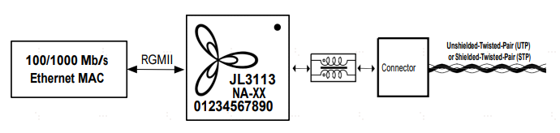
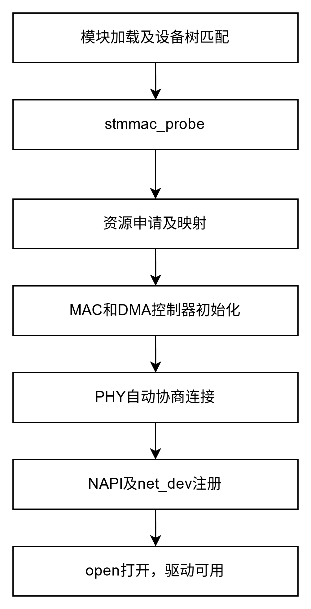
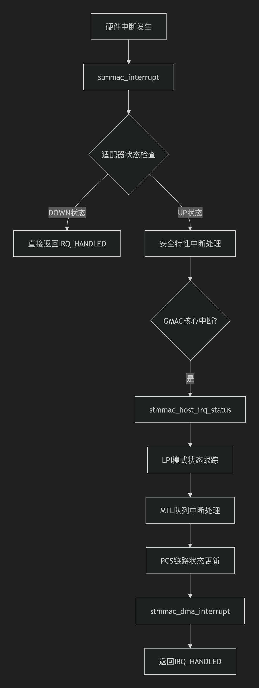

## 1. 网卡子系统
SerDes子系统包括以下组件：
* PCIe控制器：提供为PCIe根复合体或端点实现PCIe端口的解决方案应用。
* PHY：支持多种PCIe和以太网操作模式
* XPCS控制器：在MAC和PMA之间提供接口，以支持SGMII传输/接收
* Subsystem-level registers: 控制和配置整个subsystem

### 1.1. GMAC命令进行诊断定位
```shell
# 显示DMA描述符环的当前状态，包括RX.TX队列的每个描述符的信息
cat /sys/kernel/debug/stmmaceth/eth1/descriptors_status

# 列出DMA控制器支持的硬件特性，用于确认驱动和硬件的功能匹配
cat /sys/kernel/debug/stmmaceth/eth1/dma_cap

```

## 2. 设备树节点

### 2.1. PHY + MDIO
JL3113-车载以太网物理层收发器。
JL3113 设计用于单对双绞线通讯，支持 1Gbps 或100Mbps 的数据速率，完全符合 IEEE802.3bw 和IEEE802.3bp 标准，具有出色的 EMI/EMC 和 ESD 性能。

```shell
&gmac1 {
    mdio1 {
        #address-cells = <1>;
        #size-cells = <0>;
        compatible = "sanechips,zx298091-gmac-mdio";
        gmac_phy2:phy@3 {
            compatible = "sanechips,zx298091-phy-jl3113";
            reg = <0x3>;
            max-speed = <1000>;
            speed = <1000>;
            duplex = <1>;
        };
    };
};

```

阅读代码发现，PHY初始化是uboot帮忙初始化的，所以在linux中，没有对该设备的初始化。
```cpp
uboot_2023/u-boot-v2023.07.02/drivers/net/phy/phy.c

#ifdef CONFIG_PHY_JL3113
#ifdef CONFIG_DM_ETH
static struct phy_device *phy_connect_jl3113(struct mii_dev *bus,
						 struct udevice *dev,
						 phy_interface_t interface,
						 int phyaddr)
#else
static struct phy_device *phy_connect_jl3113(struct mii_dev *bus,
						 struct eth_device *dev,
						 phy_interface_t interface,
						 int phyaddr)
#endif
{
	struct phy_device *phydev = NULL;
	int sn = dev_of_offset(dev);
	int off;

	while (sn > 0) {
		off = fdt_node_offset_by_compatible(gd->fdt_blob, sn, "sanechips,zx298091-phy-jl3113");
		if (off > 0) {
            phydev = phy_device_create(bus, phyaddr, PHY_JL3113_ID, true);
            phydev->speed = fdtdec_get_int(gd->fdt_blob, off, "speed", -1);
            phydev->duplex = fdtdec_get_int(gd->fdt_blob, off, "duplex", -1);
            break;
		}

        if (off == -FDT_ERR_NOTFOUND)
			sn = fdt_first_subnode(gd->fdt_blob, sn);
		else
			printf("%s: Error finding compat string:%d\n", __func__, off);
	}

	return phydev;
}
#endif

```

#### 2.1.1. MDIO接口
MDIO：管理数据输入输出接口，是一个简单的两线串行接口，一根MDIO数据线和一根MDC时钟线。驱动程序可以通过MDIO和MDC这两根线访问PHY芯片的任意一个寄存器。
问题：如果uboot帮忙初始化PHY之后，是否linux中就不需要该设备的初始化？

### 2.2. CLK

```shell
		gmacclk: gmac-clk-ctrl {
			compatible = "sanechips,zx298091-gmac-clk";
			#clock-cells = <1>;
		};
```

### 2.3. pinctl

```shell
# mdio pinctl
                mdio1_pins: mdio1 {
                        mdio1_grp0 {
			        pins = "GPIO2";
			        function = "MDC1";
		        };

		        mdio1_grp1 {
			        pins = "GPIO3";
			        function = "MDIO1";
		        };
	        };
# gmac pinctl
                gmac1_pins: gmac1 {
                        gmac1_grp0 {
                                pins = "SAF_GPIO15";
                                function = "GMAC1_MDC";
                        };

                        gmac1_grp1 {
                                pins = "SAF_GPIO16";
                                function = "GMAC1_MDIO";
                        };

                        gmac1_grp2 {
                                pins = "SAF_GPIO17";
                                function = "GMAC1_RGMII_RMII_TXCLKOUT";
                        };

                        gmac1_grp3 {
                                pins = "SAF_GPIO18";
                                function = "GMAC1_TXEN";
                        };

                        gmac1_grp4 {
                                pins = "SAF_GPIO19";
                                function = "GMAC1_TXD0";
                        };

                        gmac1_grp5 {
                                pins = "SAF_GPIO20";
                                function = "GMAC1_TXD1";
                        };

                        gmac1_grp6 {
                                pins = "SAF_GPIO21";
                                function = "GMAC1_TXD2";
                        };

                        gmac1_grp7 {
                                pins = "SAF_GPIO22";
                                function = "GMAC1_TXD3";
                        };

                        gmac1_grp8 {
                                pins = "SAF_GPIO23";
                                function = "GMAC1_RXCLK";
                        };

                        gmac1_grp9 {
                                pins = "SAF_GPIO24";
                                function = "GMAC1_RXEN";
                        };

                        gmac1_grp10 {
                                pins = "SAF_GPIO25";
                                function = "GMAC1_RXD0";
                        };

                        gmac1_grp11 {
                                pins = "SAF_GPIO26";
                                function = "GMAC1_RXD1";
                        };

                        gmac1_grp12 {
                                pins = "SAF_GPIO27";
                                function = "GMAC1_RXD2";
                        };

                        gmac1_grp13 {
                                pins = "SAF_GPIO28";
                                function = "GMAC1_RXD3";
                        };

                        gmac1_grp14 {
                                pins = "SAF_GPIO72";
                                function = "GMAC1_PTP_PPS_O";
                        };
                };
```

### 2.4. MAC

```shell
                gmac1:gmac@40122000 {
                        compatible = "sanechips,zx298091-gmac";
                        #address-cells = <2>;
                        #size-cells = <2>;
                        reg = <0x0 0x40122000 0x0 0x2000>;
                        status = "ok";
                        interrupt-parent = <&gic>;
                        interrupts = <GIC_SPI 75 IRQ_TYPE_LEVEL_HIGH>;
                        interrupt-names = "macirq";
                        tx-fifo-depth = <8192>;
                        rx-fifo-depth = <8192>;
                        snps,txpbl = <16>;//set txpbl 16
                        snps,no-pbl-x8;//disable pblx8
                        local-mac-address = [00 11 22 33 44 66];
                        phy-mode = "sgmii";
                        pcie_phandle = <&gmac_pcie>;
                        clocks = <&gmacclk GMAC_ACLK>, <&gmacclk GMAC_PTP_REF>,
                                <&gmacclk GMAC_TX_PCS>, <&gmacclk GMAC_RX_PCS>,
                                <&gmacclk GMAC0_CLK_TX_SGMII>, <&gmacclk GMAC0_CLK_TX_RGMII>,
                                <&gmacclk GMAC0_CLK_TX_RMII>, <&gmacclk GMAC0_CLK_TX_MII>,
                                <&gmacclk GMAC0_CLK_RX_SGMII>, <&gmacclk GMAC0_CLK_RX_RGMII>,
                                <&gmacclk GMAC0_CLK_RX_RMII>, <&gmacclk GMAC0_CLK_RMII>;
                        clock-names = "aclk", "ptp_ref",
                                        "tx_pcs", "rx_pcs",
                                        "tx_sgmii", "tx_rgmii",
                                        "tx_rmii", "tx_mii",
                                        "rx_sgmii", "rx_rgmii",
                                        "rx_rmii", "rmii";
                        fixed-link
                        {
                                speed = <1000>;
                                full-duplex;
                        };
                };

```
fixed-link子节点：配置速率为1000M全双工；
GMAC需要两个时钟：<&gmacclk GMAC_ACLK>（主时钟）, <&gmacclk GMAC_PTP_REF>（用于PTP时间同步）,
其他时钟用于支持多种PHY接口模式：如sgmii模式下使用GMAC0_CLK_TX_SGMII和GMAC0_CLK_RX_SGMII；rgmii模式下使用GMAC0_CLK_TX_RGMII和GMAC0_CLK_RX_RGMII。


### 2.5. PCIE支持
```shell
                gmac_pcie: gmac_pcie@0x42300000 {
                        #address-cells = <2>;
                        #size-cells = <2>;
                        reg = <0x0 0x42300000 0x0 0xb8>,
                                <0x0 0x42480000 0x0 0x210>,
                                <0x0 0x42800000 0x0 0x184>,
                                <0x0 0x4010b000 0x0 0x1000>,
                                <0x0 0x40012000 0x0 0x4fc>;
                };

```

### 2.6. gic中断
```shell
                gic: interrupt-controller@40800000 {
                        compatible = "arm,gic-v3";
                        #interrupt-cells = <3>;
                        #address-cells = <2>;
                        #size-cells = <2>;
                        interrupt-controller;
                        reg = <0 0x40800000 0 0x10000>, /* GIC Dist */
                              <0 0x40900000 0 0x4080000>, /* GICR (RD_base + SGI_base) */
                              <0 0x40a00000 0 0x2000>, /* GICC */
                              <0 0x40a10000 0 0x2000>, /* GICH */
                              <0 0x40a20000 0 0x2000>; /* GICV */
                        /*interrupts = <GIC_PPI 9 IRQ_TYPE_LEVEL_HIGH>;*/
                };
```

## 3. 整体数据结构及源码分析

代码目录：
```cpp
stmmac/
├── Makefile
├── stmmac_main.c         // 主驱动入口及核心逻辑
├── stmmac.h              // 主头文件，核心结构体与接口
├── stmmac_platform.c     // 平台相关适配/资源分配
├── stmmac_pci.c          // PCIe 适配
├── dwmac-*.c/.h          // 各种 SoC 适配 Glue 层
├── zx298091_gmac.c      // zx298091适配 Glue 层
├── mmc_core.c           // 以太网统计/管理
├── stmmac_ethtool.c      // ethtool 工具支持
├── stmmac_selftest.c      // 自检与测试
└── ...                   // 其他相关文件
```
1) stmmac驱动支持platform设备，入口为stmmac_platform.c
2) 驱动对硬件平台不同，可通过Glue层（如具体board.c）适配，保证通用性
3) DMA、PHY管理代码高度模块化，可以定制扩展
4) NAPI是Linux下高性能数据包处理框架，减少中断风暴，提高吞吐量


### 3.1. 驱动层面：
#### 3.1.1. GMAC的私有属性 - struct s32cc_priv_data
目前认为是GMAC IP与SOC之间私有属性：
```cpp
struct s32cc_priv_data {

    void __iomem *top_crm_ioaddr;
    void __iomem *pcie_comm_ioaddr;
    void __iomem *pcie_crm_ioaddr;
    void __iomem *safety_ioaddr;
    void __iomem *ipc_ioaddr;

	struct device *dev;
	phy_interface_t intf_mode;
	struct clk *tx_clk;
	struct clk *rx_clk;
	int bus_id;

	/* Serdes */
	int link_an;
	bool phyless_an;
	struct phy *serdes_phy;
};
```

#### 3.1.2. 核心结构体 - stmmac_priv
stmmac_priv 是 stmmac 驱动的主私有数据，保存了所有运行时状态、资源句柄和配置信息。位于 stmmac.h
```cpp
struct stmmac_priv {
	u32 tx_coal_frames;
	u32 tx_coal_timer;
	u32 rx_coal_frames;
	int tx_coalesce;
	int hwts_tx_en;
	bool tx_path_in_lpi_mode;
	bool tso;
	int sph;
	u32 sarc_type;
	unsigned int dma_buf_sz;
	unsigned int rx_copybreak;
	u32 rx_riwt;
	int hwts_rx_en;
	void __iomem *ioaddr;
	struct net_device *dev;
	struct device *device;
	struct mac_device_info *hw;
	int (*hwif_quirks)(struct stmmac_priv *priv);
	struct mutex lock;
	/* RX Queue */
	struct stmmac_rx_queue rx_queue[MTL_MAX_RX_QUEUES];
	unsigned int dma_rx_size;
	/* TX Queue */
	struct stmmac_tx_queue tx_queue[MTL_MAX_TX_QUEUES];
	unsigned int dma_tx_size;
	/* Generic channel for NAPI */
	struct stmmac_channel channel[STMMAC_CH_MAX];
	int speed;
	unsigned int flow_ctrl;
	unsigned int pause;
	...
};

```

1）数据包处理与队列管理
（1）发送TX相关
    tx_queue：TX队列数组（支持多队列）
    dma_tx_size: TX DMA缓冲区大小
    tx_local_frames:TX帧数阈值（触发中断前可送达的帧数）
    tx_local_timer： TX超时阈值（触发中断前的最大时间）
    tx_coalesce: 是否启动TX聚合(Interrupt Coalescing)
    tso:是否支持TCP segmentation iffload
（2）接收RX相关
    rx_queue:
    dma_rx_size:
    rx_local_frames:
    rx_riwt:中断唤醒时间
    rx_copybreak:小数据包拷贝阈值（低于此值拷贝到SKB）
（3）NAPI与多队列
    channel：NAPI通道（软中断上下文）
    dma_cap:DMA能力（多队列、RSS等）
2）硬件抽象与寄存器访问
ioaddr：MAC寄存器基地址（映射后的虚拟地址）
hw：MAC硬件操作函数集（hw->mac->set_mac）
plat:平台数据（时钟、PHY模式等）
dma_buf_sz:DMA缓冲区大小

3）网络协议与功能支持
（1）时间同步（PTP）
ptp_clock: PTP硬件时钟
ptp_clock_ops:PTP时钟操作函数
tstamp_config：硬件时间戳配置
（2）流量控制（Flow Control）
flow_ctrl:流控模式
pause:PAUSE帧配置
（3）VLAN 与 RSS
成员	类型	说明
active_vlans：活动的 VLAN ID 位图
rss：Receive Side Scaling (RSS) 配置
4）电源管理与低功耗
wolopts：Wake-on-LAN 选项（如 WAKE_MAGIC)
eee_enabled：是否启用 Energy Efficient Ethernet (EEE)
tx_lpi_timer：EEE 模式下 TX LPI（低功耗空闲）定时器
5）统计与调试
xstats：扩展统计（丢包、错误等）
mmc：MMC（MAC Management Counters）寄存器值
msg_enable：调试消息级别（控制 netif_msg_* 输出）
6）关键函数指针
hwif_quirks：硬件特定配置回调（如修复芯片缺陷）

#### 3.1.3. 平台配置结构体 - plat_stmmacenet_data
平台配置结构体描述硬件平台的所有资源和能力（如时钟、PHY模式、DMA配置等）。

```cpp
struct plat_stmmacenet_data {
	int bus_id;
	int phy_addr;
	int interface;
	phy_interface_t phy_interface;
	struct stmmac_mdio_bus_data *mdio_bus_data;
	struct device_node *phy_node;
	struct device_node *phylink_node;
	struct device_node *mdio_node;
	struct stmmac_dma_cfg *dma_cfg;
	struct stmmac_est *est;
	int clk_csr;
	int has_gmac;
	int enh_desc;
	int tx_coe;
	int rx_coe;
	int bugged_jumbo;
	int pmt;
	int force_sf_dma_mode;
	int force_thresh_dma_mode;
	int riwt_off;
	int max_speed;
	int maxmtu;
	int multicast_filter_bins;
	int unicast_filter_entries;
	int tx_fifo_size;
	int rx_fifo_size;
	u32 addr64;
	u32 rx_queues_to_use;
	u32 tx_queues_to_use;
	u8 rx_sched_algorithm;
	u8 tx_sched_algorithm;
	...
};

```
1. 基础硬件标识
   1. bus_id:总线标识符
   2. phy_addr：PHY的MDIO地址
   3. phy_interface:PHY接口模式（PHY_INTERFACE_MODE_SGMII）
2. MAC控制器特性
   1. has_gmac:是否支持GMAC
   2. has_gmac4:是否支持GMAC4（增强版）
   3. has_xgmac：是否支持XGMAC（万兆MAC）
   4. enh_desc：是否使用增强描述符模式
   5. tx_core/rx_core: 是否启动TX/RX校验和卸载
3. DMA和缓冲区配置
   1. dma_cfg:dma缓冲区、突发模式等配置
   2. force_sf_dma_mode：强制使用Store-and-Forward DMA模式
   3. tx_fifo_size/rx_fifo_size：TX/RX FIFO大小
4. 队列与调度
   1. rx_queue_to_use/tx_queue_to_use：RX/TX队列数量
   2. rx_sched_algorithm、tx_sched_algorithm：调度算法（如加权轮询SP）
   3. rx_queues_cfg / tx_queues_cfg：每个队列的独立配置（权重、优先级）
5. 时钟与电源管理
   1. stmmac_clk / pclk：MAC 核心时钟、外设时钟
   2. pmt：是否支持电源管理（Magic Packet/WoL）
   3. en_tx_lpi_clockgating：是否启用 TX 低功耗时钟门控
6. 高级功能
   成员	类型	说明
    tso_en：是否支持 TCP 分段卸载（TSO）
    rss_en：是否支持接收侧扩展（RSS）
    ptp_max_adj：PTP 时钟最大调整值
    eee_usecs_rate	unsigned：EEE（节能以太网）唤醒时间
7. 回调函数（平台定制）
   1. fix_mac_speed：调整 MAC 速度的回调
   2. init / exit：平台初始化/退出函数
   3. setup：硬件信息初始化回调


## 4. 初始化流程
可以通过初始化流程，了解网卡驱动注册流程，驱动平台总线实现。同时可以理清楚各个数据结构之间的关系：



基于platform总线设备模型注册驱动：
```cpp
static const struct of_device_id zx298091_dwmac_match[] = {
	{ .compatible = "sanechips,zx298091-gmac" },
	{ }
};
MODULE_DEVICE_TABLE(of, zx298091_dwmac_match);

static struct platform_driver ZX298091_dwmac_driver = {
	.probe  = zx298091_dwmac_probe,
	.remove = zx298091_dwmac_remove,
	.driver = {
		.name = "zx298091-dwmac",
		.pm   = &stmmac_pltfr_pm_ops,
		.of_match_table = zx298091_dwmac_match,
	},
};
module_platform_driver(ZX298091_dwmac_driver);

```
核心流程：
```cpp
static int zx298091_dwmac_probe(struct platform_device *pdev)
-> gmac = devm_kzalloc(&pdev->dev, sizeof(*gmac), GFP_KERNEL);
-> plat_dat = stmmac_probe_config_dt(pdev, &stmmac_res.mac);

-> ret = stmmac_dvr_probe(&pdev->dev, plat_dat, &stmmac_res); // 进入驱动加载核心模块
```
### 4.1. 驱动入口stmmac_dvr_probe函数
初始化流程：
```cpp
stmmac_dvr_probe()
├─ 分配net_device和私有数据结构
├─ stmmac_hw_init()          // 硬件初始化
│  ├─ stmmac_hwif_init()     // 硬件接口初始化
│  └─ stmmac_get_hw_features() // 获取硬件能力
├─ 网络设备配置(ndev->netdev_ops等)
├─ DMA和缓冲区配置
│  ├─ alloc_dma_desc_resources()
│  ├─ init_dma_desc_rings()
│  └─ stmmac_init_dma_engine()
├─ MDIO/PHY初始化
│  ├─ stmmac_mdio_register()
│  └─ stmmac_phy_setup()
├─ 注册网络设备(register_netdev)
└─ 启动设备(后续通过open)
```
1) 分配并初始化网络设备
```cpp
ndev = devm_alloc_etherdev_mqs(device, sizeof(struct stmmac_priv),
                          MTL_MAX_TX_QUEUES, MTL_MAX_RX_QUEUES);
priv = netdev_priv(ndev);
```
2) 从设备树或platform资源中获取寄存器基址、中断号等关键信息；
```cpp
priv->ioaddr = res->addr;
priv->dev->irq = res->irq;
priv->wol_irq = res->wol_irq; // Wake-on-LAN 专用中断
```
3) 调用stmmac_hw_init完成MAC和DMA控制器硬件初始化
```cpp
ret = stmmac_hw_init(priv);  // 初始化 MAC 和 DMA 控制器

```
4) 网络设备特性配置，声明网卡支持的硬件特性，供协议栈使用。

```cpp
ndev->hw_features = NETIF_F_SG | NETIF_F_IP_CSUM | NETIF_F_IPV6_CSUM | NETIF_F_RXCSUM;
ndev->features |= ndev->hw_features | NETIF_F_HIGHDMA;

```
5) NAPI初始化，为每个RX/TX队列注册NAPI（NewAPI）轮询机制。

```cpp


```
6) 注册net_device到linux网络栈，接口上报到ifconfig/ip可见

```cpp
ret = register_netdev(ndev);  // 向内核注册网络设备

```

## 5. 收包流程stmmac_rx
该函数是 STMMAC 网卡驱动的接收数据包处理核心，由 NAPI（New API）轮询机制调用，负责从 DMA 环形缓冲区（RX Ring）中读取接收到的数据帧，并将其递交给内核网络协议栈。以下是关键流程：
1. 从 DMA 描述符环读取数据包：
遍历 RX 描述符环（rx_q->dma_rx 或 rx_q->dma_erx），检查描述符状态（status），通过 stmmac_rx_status() 判断数据包是否有效（如 discard_frame 表示丢弃）。
2. 构建 SKB（Socket Buffer）：
若数据包有效，分配或复用 sk_buff（napi_alloc_skb），并将 DMA 缓冲区中的数据拷贝到 SKB；支持多缓冲区（Scatter-Gather）和分片（Fragmentation）处理（skb_add_rx_frag）。
3. 协议处理：
设置 SKB 的协议类型（eth_type_trans）并处理校验和（Checksum Offload，CHECKSUM_UNNECESSARY 或 CHECKSUM_NONE）。
4. 提交到协议栈：
通过 napi_gro_receive() 将 SKB 递交给内核网络协议栈（GRO 优化合并）。
5. 统计与错误处理：
更新接收统计（rx_packets、rx_bytes、rx_errors）。保存未完成帧的状态（rx_q->state_saved），供下次中断继续处理。
6. 缓冲区回收与填充：
释放已使用的 DMA 缓冲区（page_pool_recycle_direct），重新填充 RX 环（stmmac_rx_refill），确保后续数据可接收。

## 6. 发包流程stmmac_xmit
stmmac_xmit 是 STMMAC 网卡驱动的数据发送入口函数，负责将 sk_buff（网络数据包）通过 DMA 传输到硬件队列。以下是核心流程：
1. TSO（TCP Segmentation Offload）处理
如果数据包支持 TSO（大帧分片卸载），调用stmmac_tso_xmit由硬件分片发送。
2. 队列空间检查
检查TX队列剩余空间是否足够（stmmac_tx_avail），不足时暂停队列（netif_tx_stop_queue）。
3. 描述符配置
根据数据包类型（普通帧、巨帧、分片帧）配置 DMA 描述符：
普通帧：直接映射线性数据区（skb->data）。
分片帧（Scatter-Gather）：逐个映射 skb_frag 片段到描述符。
4. 触发 DMA 传输
设置描述符的 OWN 位（移交硬件控制），通过 stmmac_enable_dma_transmission 启动 DMA 发送。
5. 统计与清理
更新发送统计（tx_bytes、tx_dropped），若 DMA 映射失败，释放 SKB 并记录错误。

## 7. 中断处理流程
STMMAC的中断处理函数主要处理以下几类中断：
1. DMA中断（传输和接收完成等）
2. 主机中断
3. 安全特性中断

函数流程：
1. 获取网络设备对应的私有数据结构
2. 判断是否是唤醒中断，如果是，则记录唤醒事件
3. 检查适配器是否已经关闭
4. 检查安全特性中断（如果配置）
5. 处理GMAC核心中断
   1. 检查每个队列的MTL中断
6. 处理DMA中断

```cpp
static const struct net_device_ops stmmac_netdev_ops = {
	.ndo_open = stmmac_open,
	.ndo_start_xmit = stmmac_xmit,
    .....
}

static int stmmac_open(struct net_device *dev)
-> ret = request_irq(priv->wol_irq, stmmac_interrupt,
				  IRQF_SHARED, dev->name, dev);
    -> static irqreturn_t stmmac_interrupt(int irq, void *dev_id)
```



## 8. 参考文献

[gmac传输流程](https://blog.csdn.net/m0_74825135/article/details/145978425)

## 9. Q&A
问题1：网卡中断处理流程？请问是怎么处理中断的？网卡中断处理函数是怎样的？

问题2：什么事NAPI轮询模式？怎么实现的？
Linux里面的网络数据接收也有轮询和中断两种，中断的好处就是响应快，数据量小的时候处理及时，速度快，但是一旦数据量大，而且都是短帧的时候会导致中断频繁发生，消耗大量的CPU处理时间在中断自身处理上。
轮询：响应没有中断及时，但是在处理大量数据时候不需要消耗过多的CPU处理时间。Linux在两个处理方式的基础上提出了另外一种网络接收处理方法：NAPI。
NAPI核心思想：不全部采用中断来读取网络数据，而是采用中断来唤醒数据接收服务程序，在接收服务程序中采用POLL的方法来轮询处理数据。这种方法的好处就是提高数据包的接收效率，减少中断处理时间。
