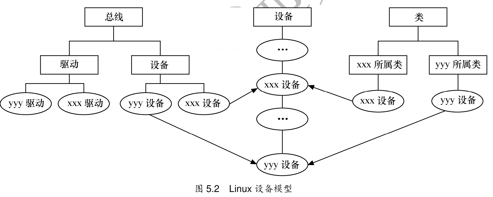

linux系统中虚拟文件系统、磁盘文件（Flash、Rom、SD卡等文件系统中的文件也属于磁盘文件）及一般的设备文件与设备驱动程序之间的关系。


应用程序和VDS之间的接口是系统调用，而VFS与磁盘文件系统以及普通设备之阿金的接口是file_operations结构体成员函数，这个结构体包含对文件进行打开、关闭、读写、控制的一系列成员函数。

由于字符设备的上层没有磁盘文件系统，所以字符设备的file_operations成员函数就直接由设备驱动提供了，file_operations正是字符设备驱动的核心。

而对于块设备而言，ext2、fat等文件系统中会实现针对VFS的file_operations成员函数，设备驱动层看不到file_operations的存在。

### 字符设备和块设备简述
字符设备是指以字符（如字节）为单位进行输入输出操作的设备。它们按照字符流的方式处理数据，例如键盘、鼠标和终端设备。字符设备以串行方式读取和写入数据，没有固定的块大小。
块设备驱动是用于管理块设备的驱动程序。块设备以固定大小的数据块（通常是512字节）进行输入输出操作，例如硬盘和闪存驱动器。块设备驱动实现了对存储设备的访问和管理，包括缓存、磁盘调度和数据传输控制等功能。
两者的区别在于数据处理单位和操作方式。字符设备以字符为单位处理数据，块设备以固定大小的数据块为单位处理数据。
字符设备和块设备驱动在Linux等操作系统中都有对应的驱动程序，用于管理和控制设备的输入输出操作。

所以在设备驱动程序设计中，一般而言，会关心结构体file和inode这两个结构体。

### file结构体
文件结构体代表一个打开的文件（设备对应于文件），系统中每个打开的文件都在内核中有一个关联的struct file。
### inode结构体
VFS inode包含文件访问权限、属主、组、大小。
他是linux关联文件系统的最基本的单位，也是文件系统连接任何子目录、文件的桥梁。
inode有主设备号，次设备号。

```shell
[root@qemu_imx6ul:~]# cat /proc/devices
Character devices:
  1 mem
  4 /dev/vc/0
  4 tty
  5 /dev/tty
  5 /dev/console
  5 /dev/ptmx
  7 vcs
 10 misc
 13 input
 29 fb
 81 video4linux
 89 i2c
 90 mtd
```
主设备号是与驱动对应的概念，同一类设备一般是使用相同的主设备号，不同类的设备一般使用不同的主设备号。
因为同一驱动可支持多个同类设备，因此用次设备号来描述使用该驱动的设备的序号，序号一般从 0 开始。

# 设备文件系统devfs
devfs设备文件系统，使得设备驱动程序能自主地管理它自己的设备文件。
1. 可以通过程序在设备初始化时在/dev目录下创建设备文件，卸载设备时将他删除。
2. 设备驱动程序可以指定设备名、所有者和权限位。
3. 不再需要为设备驱动程序分配主设备号以及处理此设备号。

# udev设备文件系统

## sysfs文件系统与linux设备模型

```shell
[root@qemu_imx6ul:/sys]# ls
block     class     devices   fs        kernel    power
bus       dev       firmware  fsl_otp   module
```




