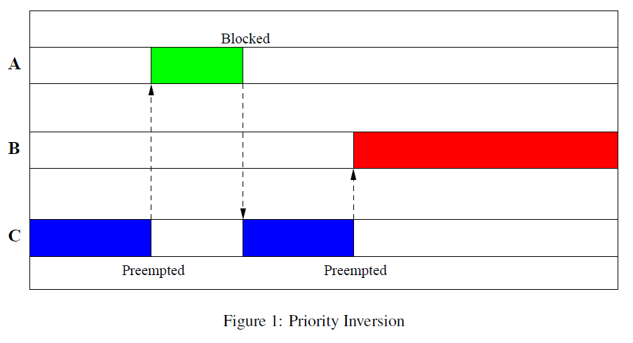
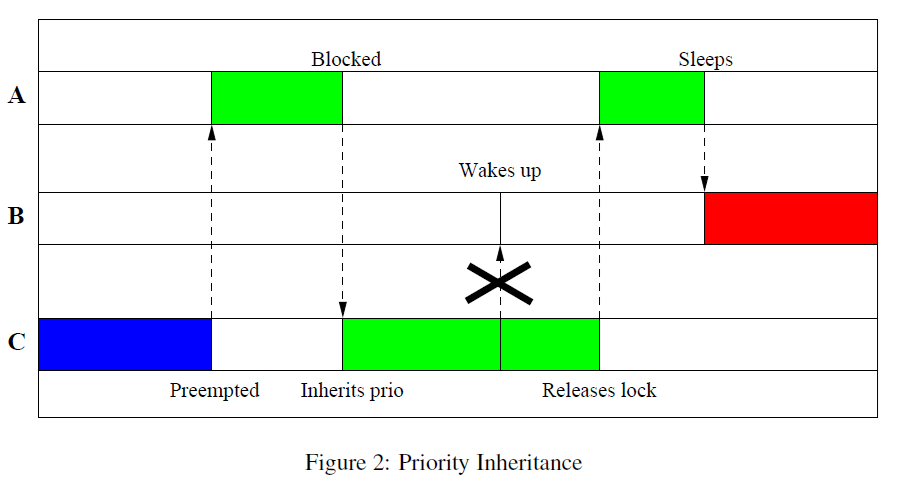

# 优先级反转（priority inversion）
[参考 1] Internals of the RT Patch, Steven Rostedt, Darren V. Hart, 2007

正常情况下，高优先级的任务应该能够及时抢占低优先级的任务才对，但某些条件下，也会发生高优先级的任务抢占低优先级的任务而不得不等待低优先级的任务执行完才能获得处理器并执行，这就是所谓的优先级反转。
发生优先级反转需要满足如下条件：
* 高优先级的任务喝低优先级的任务共享某些资源（譬如：互斥量mutex或者自旋锁spinlock）
* 这些共享资源被低优先级任务先获得而高优先级任务不得不等待。

只要上述条件满足，就会发生优先级反转，这是无法避免的。

问题1：需要解决无限制优先级反转，高优先级的任务可能被低优先级的任务阻塞，但阻塞的时长只要是可控的（譬如低优先级任务可以预期快速完成其工作并释放共享资源），反之，如果阻塞时间对于高优先级任务来说存在不确定的情况，那么就需要注意任务的延迟问题。

上图分析：
这个例子的三个任务的优先级为：A>B>C，且假设一个处理器。
A和C共享资源（譬如一个lock）。发生的无限制优先级反转时序如下：
1. 假设C先唤醒并获取这个lock
2. 然后A唤醒，抢占C并尝试获取lock失败，进入Blocked状态
3. C继续执行
4. 此后，**在C还为来得及释放lock之前**被B抢占。B虽然优先级低于A，但是A却无法抢占B，因为A在等待C释放lock。此时，因为B优先级高于C，只要B不主动释放处理器，C是没有机会释放lock的，这就造成一个现象，就是A优先级高于B，但本质上B却无法一直被A抢占，在A和B之间实际上发生了优先级反转。更糟糕的是，B的出现完全独立于A和C，它是一个完全不受我们控制的任务（A和C存在资源共享，实际上存在预期性）。这导致了A和B之间的优先级反转关系很大可能升级为“无限制优先级反转”，极端条件B进入死循环，那么A永远无法抢占CPU执行。

## 优先级继承（Priority Inheritance）

linux中解决优先级反转（严格说解决无限制优先级反转）的方案是优先级继承。
优先级继承核心思想：当高优先级的任务A因为资源的问题被一个低优先级的任务C阻塞，我们需要临时提高C的优先级与被阻塞的高优先级的任务A的优先级一致（就好像低优先级的任务继承了高优先级任务的优先级一样），这样一来，原优先级的任务C就不会被其他优先级低于A的任务B抢占，这样C就有机会释放lock，A就可以不被B反转。当然C让出处理器的同时，继承的优先级会恢复到原先的值，这样也不会阻碍B继续抢占C。

# linux pi_futex分析

## 相关基础概念
### PI chain

在计算机科学中，特别是在并发编程和操作系统设计中，"PI 链"（也称为 "Priority Inheritance" 链）是一种避免优先级反转问题的机制。优先级反转是一种在实时系统中可能发生的情况，当一个高优先级任务被一个低优先级任务阻塞时，如果此时有另一个更高优先级的任务出现，它不能运行，因为它被低优先级任务阻塞了，而低优先级任务又在等待被高优先级任务持有的资源。

PI 链的工作原理如下：

1. **任务优先级**：系统中的每个任务或线程都有一个优先级。

2. **互斥锁**：为了访问共享资源，任务需要获取互斥锁。如果锁已经被其他任务持有，任务必须等待。

3. **优先级反转问题**：当一个低优先级任务持有互斥锁，而一个高优先级任务需要这个锁时，如果此时出现一个更高优先级的任务，它将无法运行，因为它被低优先级任务阻塞了。

4. **PI 链机制**：为了避免这种情况，PI 链机制允许低优先级任务临时“继承”等待它的最高优先级任务的优先级。这样，低优先级任务在持有互斥锁时，实际上具有足够的优先级来避免阻塞更高优先级的任务。

5. **优先级传递**：当一个任务由于持有互斥锁而被其他任务等待时，它将传递（或继承）等待任务的最高优先级给当前持有锁的任务。

6. **锁释放**：当持有互斥锁的任务释放锁时，它将恢复到原来的优先级。

PI 链机制确保了即使在多任务环境中，高优先级任务也能够获得必要的资源，从而避免了优先级反转问题，提高了系统的响应性和实时性。这种机制在实时操作系统（RTOS）中尤为重要，因为它有助于确保关键任务能够及时执行。

## linux实现原理
[linux pi_futex浅析](https://developer.aliyun.com/article/6044)
[linux futex浅析--参考论文](https://developer.aliyun.com/article/6043?spm=a2c6h.14164896.0.0.3d5747c5UieLBS&scm=20140722.S_community@@%E6%96%87%E7%AB%A0@@6043._.ID_6043-RL_futex%E6%B5%85%E6%9E%90-LOC_search~UND~community~UND~item-OR_ser-V_3-P0_0)
为了支持优先级继承，内核里面实现了一个叫rt_mutex的互斥锁。先需要分析rt_mutex.

### rt_mutex由来
rt_mutex之所以叫"rt_"，是因为优先级继承主要是为实时进程服务的。我们知道，与普通进程"根据优先级瓜分CPU时间片"的理念不同，内核总是尽量满足最高优先级的实时进程的CPU需求，直到它挂起或退出。对于实时进程来说，优先级反转的后果尤为严重。比如上述例子，考虑在单核机器下，B进程"抢占"掉A进程之后，只要B进程一直处于RUNNING状态，C进程就得不到执行，A进程就得一直挂起。而如果是普通进程的话，B进程很快会用完时间片，就算"抢占"了A进程，那也只是一瞬间的事情。

### PI chain 为什么需要
要实现优先级继承，内核需要维护一条PI chain，保存进程持有锁和等待锁的依赖关系。PI chain其实是一个树形结构：一个task可能持有多个rt_mutex，每个rt_mutex只能被一个task持有。反过来，一个rt_mutex可能让M个task挂起、而每个task又只会挂起一个rt_mutex上面。
举例：
```cpp

/**
 * The rt_mutex structure
 *
 * @wait_lock:	spinlock to protect the structure
 * @waiters:	rbtree root to enqueue waiters in priority order
 * @waiters_leftmost: top waiter
 * @owner:	the mutex owner
 */
struct rt_mutex {
	raw_spinlock_t		wait_lock;
	struct rb_root          waiters;
	struct rb_node          *waiters_leftmost;
	struct task_struct	*owner;
#ifdef CONFIG_DEBUG_RT_MUTEXES
	int			save_state;
	const char 		*name, *file;
	int			line;
	void			*magic;
#endif
};

struct rt_mutex_waiter {
	struct rb_node          tree_entry;
	struct rb_node          pi_tree_entry;
	struct task_struct	*task;
	struct rt_mutex		*lock;
#ifdef CONFIG_DEBUG_RT_MUTEXES
	unsigned long		ip;
	struct pid		*deadlock_task_pid;
	struct rt_mutex		*deadlock_lock;
#endif
	int prio;
};
```
rt_mutex_waiter结构是作为task在rt_mutex上挂起时的连接件而存在的，其实它逻辑上应该是task_struct的一部分，只不过这个部分只是在PI chain中才有用。rt_mutex_waiter.task和task_struct.pi_blocked_on相互指向。


```cpp
// 在task_struct中：
#ifdef CONFIG_RT_MUTEXES
	/* PI waiters blocked on a rt_mutex held by this task */
	struct rb_root pi_waiters;
	struct rb_node *pi_waiters_leftmost;
	/* Deadlock detection and priority inheritance handling */
	struct rt_mutex_waiter *pi_blocked_on;
#endif

```
task通过pi_waiters可以遍历到它持有的每个rt_mutex上挂起的最高优先级的task（top waiter）.这个遍历逻辑就是由plist（有序链表）提供的，里面挂着rt_mutex_waiter会以其所对应的task优先级来排序。这样，一个task能继承到的优先级就是通过pi_waiters取到的第一个rt_mutex_waiter所对应的task（称作top pi waiter）的优先级。
因为这里只需要关心最高优先级，所以每个rt_mutex只需要将自己的top waiter的提供上来就可以了，不必全部加进来。这个遍历关系是PI chain中最重要的一环，通过它来完成优先级继承。

### rt_mutex内核优先级继承实现原理
rt_mutex则可以通过wait_list来遍历在它身上挂起的rt_mutex_waiter，从而遍历到挂起的task。这个遍历关系则是描述锁依赖关系的原始信息，为构建上一种遍历关系而存在。试想，当一个进程新持有一把锁时，rt_mutex.wait_list中的top waiter（rt_mutex_waiter）将加入到task_struct.pi_waiters链表中；当rt_mutex.wait_list中的进程优先级发生变化，导致top waiter改变时，需要将原来的top waiter从task_struct.pi_waiters里面移出，然后把新的top waiter加进去。为了这个过程的顺利进行，rt_mutex.wait_list也是一个按优先级排序的plist。
上述过程会导致task的pi_waiters发生变化，可能导致top pi waiter改变，从而重置进程优先级。

作为其中核心的rt_mutex，其实是一个很简单的结构，只有图中所列的owner和wait_list、外加一把spinlock。对它的上锁操作很简单，把owner指针指向持有者进程即可。而spinlock则用于保护lock/unlock过程，以及将进程挂入/移出PI chain的过程。
而如果不存在竞争，rt_mutex可以利用cmpxchg原子指令直接尝试lock/unlock：cmpxchg(rt_mutex.owner, NULL, current) / cmpxchg(rt_mutex.owner, current, NULL)。如果owner指针为NULL，原子性的修改为当前进程，则lock成功。否则说明已经被上锁，就需要上spinlock、然后修改PI chain；反过来，如果owner指针指向当前进程，原子性的修改为NULL，则unlock成功。否则说明锁有等待者（owner指针会打上flag，使得它不等于当前进程），需要上spinlock、修改PI chain、然后唤醒top waiter。

### pi_futex登场

```cpp
int futex_lock_pi(int *uaddr);
int futex_trylock_pi(int *uaddr);
int futex_unlock_pi(int *uaddr);
```

可以分析futex的核心思想是什么？

那就是用户态的锁变量与内核态futex机制的互动。pi_futex也不例外。
在锁没有竞争的情况下，用户态通过对锁变量的原子指令操作，依然可以完成pi_futex的上锁和解锁。但是锁变量的取值跟普通的mutex不太一样（普通mutex一般用0值表示未上锁、1是上锁、2是上锁且有进程挂起等待），pi_futex下，锁变量0值表示未上锁，上锁时写入owner进程的tid（全局的线程id），有进程挂起时在tid的基础上增加一个RT_MUTEX_HAS_WAITERS标记。
为什么要这样定呢？考虑这么一个场景，锁a处于未上锁状态(* uaddr==0)，然后进程A和B相继对其做lock操作。进程A在用户态就能lock成功了，而进程B则需要调用futex_lock_pi进入内核，然后被挂起。进程B挂起的时候，A和B应该会形成PI chain，但是A上锁的时候根本就没经过内核。换句话说，内核怎样得知进程A的信息，并构造出这条PI chain呢？就是通过记在* uaddr里面的tid。当然，这个tid是用户自己填的。如果用户乱填，是可以让自己的程序没法工作的:）（可能会让一个不相干的进程莫名其妙的成了rt_mutex的owner，或者futex_lock_pi找不到对应tid的进程，而返回失败。用户总是可以让自己的程序出问题的，不是么？）

有了A进程的tid，要构造PI chain还缺些什么呢？对啊，rt_mutex都还没创建出来。这就引出了pi_futex中的一个最重要的逻辑：uaddr跟rt_mutex的对应。

### uaddr 
跟普通futex一样，uaddr在内核中会对应一个"等待队列"（其实是一个全局的队列）。挂起的进程在等待队列中对应一个futex_q结构（这是说明一个等待队列，对应一个struct futex_q 对象？）：
```cpp
struct futex_q {
    struct plist_node list;             // 链入等待队列
    struct task_struct *task;           // 挂起的进程本身
    spinlock_t *lock_ptr;               // 保存等待队列的锁，便于操作
    union futex_key key;                // 唯一标识uaddr的key值
    struct futex_pi_state *pi_state;    // 进程正在等待的锁
    struct rt_mutex_waiter *rt_waiter;  // 进程对应的rt_waiter
    union futex_key *requeue_pi_key;    // 等待被requeue的key
    u32 bitset;                         // futex_XXX_bitset时使用
};
```
其中的pi_state其实就是rt_mutex。由于存在于pi_futex体系中需要额外的关联信息，所以使用pi_state对rt_mutex做了包装：

```cpp
struct futex_pi_state {
    struct list_head list;      // 链入持有者进程的list
    struct rt_mutex pi_mutex;   // 锁本身
    struct task_struct *owner;  // 锁的持有者进程
    atomic_t refcount;          // 引用计数
    union futex_key key;        // 唯一标识uaddr的key值
};
```
futex_pi_state中的key和pi_mutex就把uaddr跟rt_mutex的绑定了起来。

引入这两个结构之后，数据模型变成了这样：
这样一来，持有uaddr对应的锁的进程，就持有了内核中对应的rt_mutex，从而能够获得相应的优先级继承；而在uaddr对应的锁上挂起的进程，也就挂起到了相应的rt_mutex上，从而优先级被继承。

task通过pi_state_list可以遍历到它所持有的所有rt_mutex（via pi_state），在进程地址空间销毁（比如exit、exec）时需要释放这些rt_mutex（这个链表是关联在pi_state上的，如果不是使用pi_futex，而是内核中直接使用rt_mutex呢？就不存在这个自动销毁的逻辑了。不过rt_mutex只能内核代码才能直接使用，使用时注意管理好进程的生命周期就好了）。而既然是为销毁而准备的，这个链表只需要普通的list就足够了，不需要使用有序的plist。

问题1：这里是否就会出现进程释放futex且exit，但是在等待队列内还等着其他进程死等待而无法退出？

还需要继续分析pi_futex?


参考文献：
[官方手册futex](https://man7.org/linux/man-pages/man2/futex.2.html)