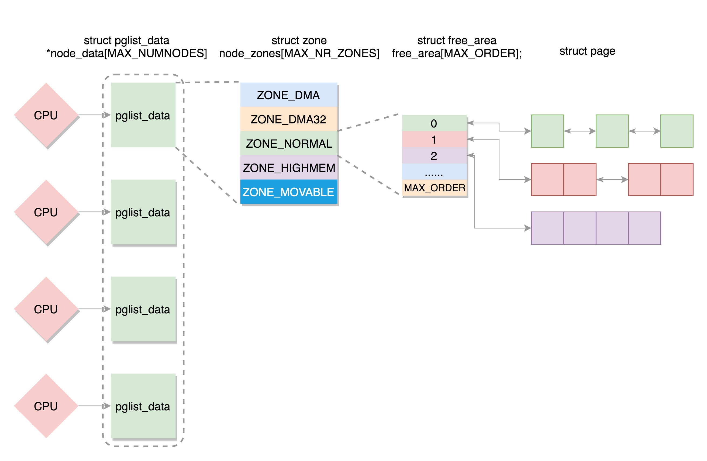
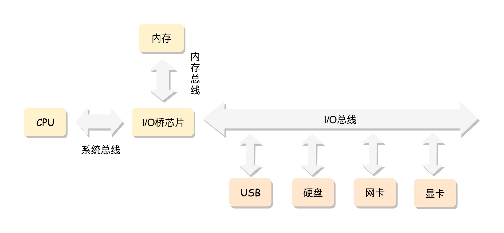
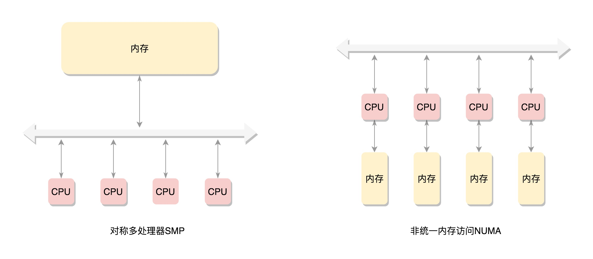

## 物理内存的三级管理结构
linux内核将物理内存管理对象分为节点、区和页框三个层次。


NUMA体系架构处理器中拥有各自本地内存节点（即分布式内存）每个物理内存对应一个节点描述符，其中包含相应内存节点的标识符、起始页框号、页框数等字段。

NUMA:如果有多个CPU，就对应多个节点。每个节点用struct pglist_data表示，放在一个数组里面。
每个节点分为多个区域，每个区域用struct zone表示，也放在一个数组里面；
每个区域分为多个页，为了方便管理，空闲页放在struct free_area里面，使用伙伴系统进行管理和分配，每一页用struct page表示。

物理内存的组织方式：非对称内存访问节点->区->页。
对于要分配比较大的内存，例如到分配页级别的，可以使用伙伴系统（Buddy System）


多个CPU，总线一侧。所有内存条组成一个大内存，在总线的一侧，所有CPU访问内存都要通过总线，这种模式SMP。
缺点：总线会成为瓶颈，因为数据都要走它。


NUMA：为了解决总线瓶颈，非一致性内存访问。

### NUMA详解
《linux内核伙伴系统分析》


```cpp
#define alloc_pages(gfp_mask, order) \
		alloc_pages_node(numa_node_id(), gfp_mask, order)

alloc_pages_node(numa_node_id(), gfp_mask, order)
    -> return __alloc_pages_node(nid, gfp_mask, order);
        -> 

/*
 * Allocate pages, preferring the node given as nid. The node must be valid and
 * online. For more general interface, see alloc_pages_node().
 */
static inline struct page *
__alloc_pages_node(int nid, gfp_t gfp_mask, unsigned int order)
{
	VM_BUG_ON(nid < 0 || nid >= MAX_NUMNODES);
	VM_WARN_ON(!node_online(nid));

	return __alloc_pages(gfp_mask, order, node_zonelist(nid, gfp_mask));
}

static inline struct page *
__alloc_pages(gfp_t gfp_mask, unsigned int order,
		struct zonelist *zonelist)
{
	return __alloc_pages_nodemask(gfp_mask, order, zonelist, NULL);
}

```
分配page核心流程：
mm/page_alloc.c中` __alloc_pages_nodemask`分析：
```cpp
/*
 * This is the 'heart' of the zoned buddy allocator.
 */
struct page *
__alloc_pages_nodemask(gfp_t gfp_mask, unsigned int order,
			struct zonelist *zonelist, nodemask_t *nodemask)

-> page = get_page_from_freelist(alloc_mask, order, alloc_flags, &ac);

```
在`__alloc_pages_nodemask`中，首先计算得到ac、alloc_gfp、alloc_flags。先以此调用get_page_from_freelist分配块，如果失败，调用__allow_pages_slowpath，后者有可能进行内存进行规整、回收，然后重新调用get_page_from_freelist.
get_page_from_freelist会从用户期望或者接受的zone（ac->high_zoneidx）开始向后遍历，例如用户期望分配ZONE_HIGHMEM的内存，函数会按照ZONE_HIGHMEM\ZONE_NORMAL和ZONE_DMA的优先级分配内存。


# 物理内存管理

## 前言
参考：
[物理内存管理](https://blog.csdn.net/yhb1047818384/article/details/111789736)

## 主要数据结构：
```cpp
typedef struct pglist_data {
	struct zone node_zones[MAX_NR_ZONES]; // 对应该node包含的各个类型的zone
	struct zonelist node_zonelists[MAX_ZONELISTS]; //
	int nr_zones;
	unsigned long node_start_pfn; // 该node中内存的起始页帧号
	unsigned long node_present_pages; // 该node地址范围内的实际管理的页面数量
	unsigned long node_spanned_pages; // 该node地址范围内的所有页面数量，包括空洞的页面
	int node_id;
	wait_queue_head_t kswapd_wait;
	wait_queue_head_t pfmemalloc_wait;
	struct task_struct *kswapd;  // 负责回收该node内存的内核线程，每个node对应一个内核线程kswapd
	int kswapd_order;
	enum zone_type kswapd_highest_zoneidx;
	int kswapd_failures;
	unsigned long		min_unmapped_pages;
	unsigned long		min_slab_pages;
	ZONE_PADDING(_pad1_)
	spinlock_t		lru_lock; // 用于保护Zone中lru链表的锁
	struct deferred_split deferred_split_queue;
	struct lruvec		__lruvec; // LRU链表的集合
	unsigned long		flags; // 内存域的当前状态，在mmzone.h定义了zone的所有可用的zone_flag
	ZONE_PADDING(_pad2_)
	struct per_cpu_nodestat __percpu *per_cpu_nodestats;
	atomic_long_t		vm_stat[NR_VM_NODE_STAT_ITEMS];
} pg_data_t;


```

## Zones

为什么需要将node拆分为不同的zone？
历史遗留问题：比如32bit处理器支持的4G的虚拟地址，然后1G的地址空间给内核，但这样无法对超过1g的物理内存进行映射。linux内核提出的解决方案是将物理内存分为2部分，一部分做线性映射，另一部分叫做高端内存。分别对应：ZONE_NORMAL和ZONE_HIGNMEM。
对于arm64，有足够大的内核地址空间可以映射物理内存，所以不需要ZONE_HIGHMEM。

```shell
zone type	descrpition
ZONE_DMA	ISA设备的DMA操作，范围是0~16M，ARM架构没有这个zone
ZONE_DMA32	用于低于4G内存进行DMA操作的32位设备
ZONE_NORMAL	标记了线性映射物理内存, 4G以上的物理内存。 如果系统内存不足4G, 那么所有的内存都属于ZONE_DMA32范围, ZONE_NORMAL则为空
ZONE_HIGHMEM	高端内存，标记超出内核虚拟地址空间的物理内存段. 64位架构没有该ZONE
ZONE_MOVABLE	虚拟内存域， 在防止物理内存碎片的机制中会使用到该内存区域
ZONE_DEVICE	为支持热插拔设备而分配的Non Volatile Memory非易失性内存
```

```shell
/ # cat /proc/zoneinfo |grep Node
Node 0, zone      DMA
Node 0, zone    DMA32
Node 0, zone   Normal
Node 0, zone  Movable
```

## Pages
物理页面通常被称作Page Frames。 Linux内核使用struct page数据结构来描述一个物理页面， 这些page数据结构会存放在一个数组中。
struct page和物理页面是一对一的映射关系。


## 初始化流程
在paging_int之后，我们接下来分析：bootmem_init->zone_sizes_init

```cpp
// mm/page_alloc
zone_sizes_init的核心就是free_area_init，该函数会遍历系统中所有的nodes。

void __init free_area_init(unsigned long *zones_size)
{
	free_area_init_node(0, zones_size,
			__pa(PAGE_OFFSET) >> PAGE_SHIFT, NULL);
}

	free_area_init_node()
			|
			|---> calculate_node_totalpages()
							|--->zone_spanned_pages_in_node()
							|--->zone_absent_pages_in_node()
			|---> alloc_node_mem_map()
			|
			|---> free_area_init_core()

static void __meminit calculate_node_totalpages(struct pglist_data *pgdat,
						unsigned long node_start_pfn,
						unsigned long node_end_pfn,
						unsigned long *zones_size,
						unsigned long *zholes_size)
会计算当前node中ZONE_DMA和ZONE_NORMAL的page数量，确定node下node_spanned_pages和node_present_pages。


```
### free_area_init_core

```shell
	free_area_init_core()
			|
			|--->pgdat_init_internals()
			|
	--------------------zone------------------------------
			|--->calc_memmap_size()
			|
			|--->zone_init_internals()
			|
			|--->set_pageblock_order()
			|
			|--->setup_usemap()
			|
			|--->init_currently_empty_zone()
					|--->zone_init_free_lists()
			|--->memmap_init()
					|--->memmap_init_zone()
    --------------------------------------------------------
```

memmap_init()初始化mem_map数组。memmap_init_zone()通过pfn找到对应的struct page，初始化page实例, 它还会将所有的页最初都标记为可移动的（MIGRATE_MOVABLE）。设置为可移动的主要还是为了避免内存的碎片化，IGRATE_MOVABLE链表中都是可以迁移的页面， 把不连续的内存通过迁移的手段进行规整，把空闲内存组合成一块连续内存，那就可以在一定程度上达到内存申请的需求。


# alloc_pages从伙伴系统中申请空间流程分析
内存初始化主要流程：
1. 在MMU打开之前的kernel space、fdt mapping
2. 打开MMU之后，通过解析dtb，初始化了memblock，进入fixmap，memblock
3. 再经过setup_init -> page_init -> bootmem_init函数初始化zone、zonelist以及struct page结构体初始化等，此时buddy sys初具模型
4. 再接下来的mm_init-> mem_init函数，会把目前空闲的mem通过_free_pages(page, order)添加到buddy sys.

## 分配接口

### 主要函数接口
(1) alloc_pages(gfp _ mask, order)请求分配一 个阶数为 order 的页块,返回 一个 page 实例。
(2) alloc_page(gfp_ mask)是函数 alloc_pages 在阶数为 0 情况下的简化形式,只分配一 页 。
(3) — get_ free_pages(gfp_mask, order)对函数 alloc_pages 做了封装,只能从低端内存区
域分配页,并且返回虚拟地址 。
(4) _get_free _page(gfp_ mask)是函数—get_ free _pages 在阶数为 0 情况下的简化形式,
只分配 一 页 。
(5) get_zeroed_page(gfp_mask)是函数—get_ free _pages 在为参数 gfp_mask 设置了标志
位—GFP_ZERO 且阶数为 0 情况下的简化形式,只分配一 页,并且用零初始化 。


### 分配标志位
1. 区域修饰符：指定从哪个区域类型分配页。
2. 页移动性和位置提示
3. 水线修饰符
4. 回收修饰符
5. 行动修饰符

```cpp
/* Plain integer GFP bitmasks. Do not use this directly. */
// 区域修饰符: 指定从哪个区域类型分配页
#define ___GFP_DMA		0x01u
#define ___GFP_HIGHMEM		0x02u
#define ___GFP_DMA32		0x04u
// part2: 页移动性和位置提示：指定页的迁移类型和从哪些内存节点分配页
#define ___GFP_MOVABLE		0x08u // 申请可移动页
#define ___GFP_RECLAIMABLE	0x10u // 申请可回收页
#define ___GFP_HIGH		0x20u
#define ___GFP_IO		0x40u
#define ___GFP_FS		0x80u
#define ___GFP_COLD		0x100u
#define ___GFP_NOWARN		0x200u
#define ___GFP_REPEAT		0x400u
#define ___GFP_NOFAIL		0x800u
#define ___GFP_NORETRY		0x1000u
#define ___GFP_MEMALLOC		0x2000u
#define ___GFP_COMP		0x4000u
#define ___GFP_ZERO		0x8000u
#define ___GFP_NOMEMALLOC	0x10000u
#define ___GFP_HARDWALL		0x20000u
#define ___GFP_THISNODE		0x40000u
#define ___GFP_ATOMIC		0x80000u
#define ___GFP_ACCOUNT		0x100000u
#define ___GFP_NOTRACK		0x200000u
#define ___GFP_DIRECT_RECLAIM	0x400000u
#define ___GFP_OTHER_NODE	0x800000u
#define ___GFP_WRITE		0x1000000u
#define ___GFP_KSWAPD_RECLAIM	0x2000000u
/* If the above are modified, __GFP_BITS_SHIFT may need updating */

```
同时定义了一些标志位的组合：

### 复合页
复合页常见的用处是创建巨型页。

### 核心函数的实现

```cpp
struct page *
__alloc_pages_nodemask(gfp_t gfp_mask, unsigned int order,
			struct zonelist *zonelist, nodemask_t *nodemask)

/**
 * gfp_mask:分配标志位
 * order： 阶数
 * zonelist： 首选内存节点的备用区域列表
 * nodemask:允许从哪些内存节点分配页，可以传入空指针
*/

/** 算法逻辑
 * 1. 根据分配标志位得到首选区域类型和迁移类型
 * 2. 执行快速路径，使用低水线尝试第一次分配
 * 3. 如果快速路径分配失败，那么执行慢速路径
 *
*/

/* 如果之前没有分配成功，这里尝试进入慢速分配，主要流程如下：
         * 1. 慢速分配首先会唤醒所有符合条件zone的kswapd线程进行内存回收
		 * 2. 再次尝试快速分配；疑问：唤醒回收线程后，不需要等待？
         * 3. 如果标记了忽略阀值，则从保留的内存里回收(__alloc_pages_high_priority)
         * 4. 然后进行内存压缩(__alloc_pages_direct_compact), 其中会尝试再次快速分配
         * 5. 最后再尝试直接内存回收，触发OOM(out_of_memory),前提是所有zones的ZONE_OOM_LOCKED锁均未被占用
		 * 6. 如果判断需要retry，则再次尝试1,2,3,4
         */
		page = __alloc_pages_slowpath(alloc_mask, order, &ac);


// 快速路径：get_page_from_freelist
// 主要函数的调用栈: 参考图解LINUX，图6-11。
在zonelist中遍历所有zone，获取指定连续的页框数：
 * 1. 在遍历zone时，如果zone当前空闲内存-申请的内存<LOW,则该zone会触发内存回收
 * 2. 第一轮循环只会尝试从preferred_zone中获取页框
 * 3. 第二轮会遍历整个zonelist的zone
```

## 页表

# 伙伴系统
## 伙伴系统之buffered_rmqueue

伙伴系统分配内存的大概流程：
1. 首先尝试从prefered_node所在的zone中直接分配
2. 不行就启动zone_reclaim回收空间，同时扩大到所有zonelist中的zone
3. 再不行就降低水位要求，进行慢速分配
4. 最后oom

CPU告诉缓存基本概念

1. 从硬件上看：高速缓存Cache是位于CPU与内存之间的临时存储器，它的容量比内存小但交换速度快L1\L2\L3
2. 从linux内核看每个cpu的高速缓存主要涉及的结构体管理：struct zone、struct per_cpu_pageset、struct per_cpu_pages
3. struct per_cpu_pages->lists中保存这以migratetype分类的单页框双向链表.
4. 如果申请内存时order=0， 则会直接从cpu高速缓存中分配.

```cpp
		page = buffered_rmqueue(ac->preferred_zoneref->zone, zone, order,
				gfp_mask, alloc_flags, ac->migratetype); // (4)

/**
 * 从伙伴系统中分配内存，分为两类
 * 1. order=0： 尝试直接从CPU缓存中分配
 *  如果CPU缓存中没有空闲内存，则首先从伙伴系统中申请bulk个order=0的空闲内存
 * 2. order>0: 尝试从zone的灰板系统中分配内存__rmqueue
 *  从free_list[order]开始找空闲内存，找不到则尝试更高一阶，直到找到为止。
*/

```
