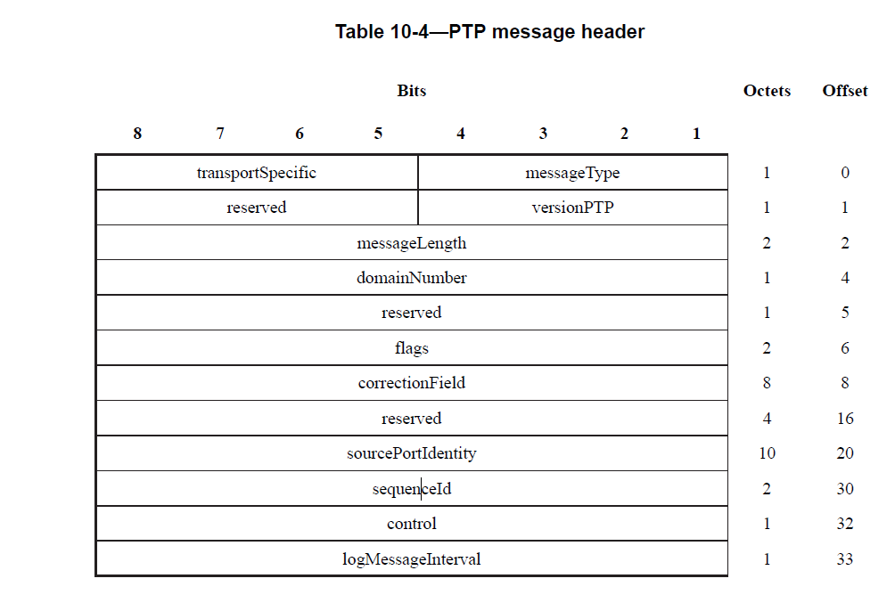

# gptp
## 简介
TSN（Time-Sensitive Networking，时间敏感型网络）技术的前身是AVB（Audio/Video Bridging，音视频桥接）技术。在以太网音视频传输领域，如果音频和视频信息没有严格的时序规则以及不具有可预测的延迟，则会出现声音和画面不一致的现象。而高清的音频和视频数据传输，带宽需求极大，实时性要求又非常高。如何保证高带宽下的实时、同步传输，成为以太网音视频传输领域的难题。
gPTP是general precise time protocol的简称，是PTP协议的派生。
gPTP的目的是确保所有局域网里的节点的时间完全一致（ns级别的误差），下面让我们直奔主题。

gPTP（generalized Precision Time Protocol，广义精确时间同步协议），基于PTP（IEEE 1588v2）协议进行了一系列优化，形成了更具有针对性的时间同步机制，可以实现μs级的同步精度。
gPTP定义有两种设备类型，Time-aware-end Station和Time-aware Bridge。每种设备都具有本地时钟，本地时钟都是通过晶振的振荡周期进行度量的，设备内部硬件计数器负责对振荡周期进行计数。设备中用来发布时间同步报文的网络端口称为主端口，用来接收时间同步报文的端口称为从端口。
（1）Time-aware-end Station，既可以作为主时钟，也可以作为从时钟。
（2）Time-aware Bridge，既可以作为主时钟，也可以作为桥接设备，类似交换机。桥接类设备在收到gPTP报文后，会请报文搓个澡，然后再送出去。而报文在桥接设备内搓澡消耗的时间，称为驻留时间。gPTP要求桥接设备必须具有测量驻留时间的能力。

### gPTP协议基于L2层传输

在OSI网络模型里，L2是MAC层，L3是IP层，我们通常见到的如交换机是L2层的转发，路由器是L3层的转发。gPTP协议是基于L2层的传播，那么就决定了一个特性，只能在局域网里传播，不能通过路由器往WAN网传输。为了达到ns级别的延时，这个也是必须做的。

### MAC上的硬件支持
为了测量更精准的时间，我们必须精准的知道一个MAC帧出去的时间，和收到一个MAC帧的时间，这个地方不能通过软件来获得，因为如果通过软件来获取时间，进出终端，任务抢占的时间是不确定的，不可测的。

## gPTP报文组成

### 三部分组成

### 报文头

### gptp报文类型

gPTP协议中的报文被划分成为了报文级别（Message Class）和报文种类（Message Type）两个属性，其中报文级别的具体划分如下

事件型报文（Event Massage）：这类报文的特点是设备在接收或发送事件类报文时，会对硬件计数器进行采样，将震荡周期计数值和时钟震荡频率以及基准时间相结合，生成一个时间戳。
通用型报文（General Massage）：这类报文在设备接受或者发送时，不会触发硬件对硬件技术器的采样，不会生成时间戳。
报文种类的划分以及对应的取值如下：

表1 报文类型对应的报文等级以及取值

## 同步过程
gPTP定义有两类报文，事件类型报文（包括Sync、Pdelay_Req、Pdelay_Resp三条）和一般类型报文（包括Follow_UP、Pdelay_Resp_Follow_UP二条）。gPTP定义设备工作在网络七层模型中的第二层数据链路层的MAC（Media Acess Control，媒介访问控制）子层。
当设备MAC层接收或发送事件类型报文时，会触发对硬件计数器进行采样，从而获得时钟振荡周期计数值，结合时钟振荡频率及基准时间，可获得此时的时间戳。而一般类型报文仅用来携带信息，不会触发内部硬件计数器的采样操作。

### 频率同步

如果主从端口时钟振荡频率不一致的时候，会导致什么灵异事件发生。假设从端口的时钟振荡频率是25MHz,则一个时钟振荡周期是40ns。主端口的时钟振荡频率是100MHz，则一个时钟时钟振荡周期是10ns。
分析：假设在一次传输延迟测量过程中，从端口在t6和t3时刻记录的振荡周期差值若为200个振荡周期。由于主端口的时钟频率是从端口的4倍，因此从端口收到t5和t4时刻的振荡周期差值大概800个。以从端口的40ns一个时钟振荡周期为基准进行计算的话，传输延迟则为-24μs（[200x40-800x40]/2）。传输不仅没有延迟，反而提前知道了，从端口大仙无疑了。
除了主从端口时钟振荡频率的先天不一致，温度、老化等原因也会导致晶振振荡频率的不稳定。为了解决频率不同步的问题，gPTP通过频率同步来实现从端口对主端口的时钟振荡频率同步。
#### 频率同步方案一：
在实际的网络中，各个节点的频率往往不是完全一致的，所以需要用两组Sync报文和两组Follow_UP来计算出各个节点之间的频率偏差。

1. 主端口发送Sync报文，报文离开主端口MAC层时，触发主端口记录此时的时间戳T1。
2. 从端口接收Sync报文，报文到达从端口MAC层时，触发从端口记录此时的时间戳T2。
3. 主端口发送Follow_UP报文，将T1值附在报文中发送。
4. 主端口发送Sync报文，报文离开主端口MAC层时，触发主端口记录此时的时间戳T3。
5. 从端口接收Sync报文，报文到达从端口MAC层时，触发从端口记录此时的时间戳T4。
6. 主端口发送Follow_UP报文，将T3值附在报文中发送。
>从端口通过下图所示公式计算出自己与主端口时钟频率的偏差R。
R = (T3-T1)/(T4-T2)

#### 频率同步方案二
频率同步复用传输延迟测量过程的Pdelay_Resp和Pdelay_Resp_Follow_UP报文。通过采用两组答复，最终可以获得t5,t6,t9,t10的值，由下面公式可得主从端口的频率比。 
R=(t9-t5)/(t10-t6)

此时主从端口频率同步的情况下，频率比等于1。如果大于1，说明主端口走得快，如果小于1，说明主端口走的慢。从端口根据频率比的值，调整自己的时基，从而获得正确的时间戳。

### 传输延迟测量
gPTP采用P2P（Peer to Peer）的方法来测量传输延迟。在P2P方法中，测量的是相邻设备间的传输延迟，报文不允许跨设备传输，这也就要求gPTP网络内的所有设备都需要支持gPTP功能。同时定义一组独立的报文专门负责传输延迟测量，分别为周期发送的Pdelay_Req、Pdelay_Resp和Pdelay_Resp_Follow_UP。

1. 从端口发送Pdelay_Req报文，报文离开从端口MAC层时，触发从端口记录此时的时间戳T5。
2. 主端口接收Pdelay_Req报文，报文到达主端口MAC层时，触发主端口记录此时的时间戳T6。
3. 主端口发送Pdelay_Resp报文，将T5的值附在报文中发送，报文离开主端口MAC层时，触发主端口记录此时的时间戳T7。
4. 从端口接收Pdelay_Resp报文，报文到达从端口MAC层时，触发从端口记录此时的时间戳T8。
5. 主端口发送Pdelay_Resp_Follow_UP报文，将T7的值附在报文中发送。
从端口通过下图公式即可算出相邻设备间的传输延迟delay。

#### 补充分析：
从端口首先发送Pdelay_Req报文，标志传输延迟测量的开始，在报文离开从端口MAC层时，触发从端口记录此时的时间戳t3。主端口MAC层收到Pdelay_Req报文后会记录此时的时间戳t4，随后，主端口通过Pdelay_Resp报文将值t4发送给从端口，同时在Pdelay_Resp报文离开主端口的MAC层时，触发主端口记录此时的时间戳t5，从端口MAC层收到Pdelay_Resp报文后记录此时的时间戳t6。随后，相同的套路，主端口通过Pdelay_Resp_Follow_Up报文将值t5发送给从端口。至此，一次传输延迟测量过程已经结束。在假设路径传输延迟是对称的前提下，可由如下公式计算相邻设备间的传输延迟。

### 时钟偏差测量
在完成频率同步和传输延迟测量的基础上，该步骤使用了一组周期性发送的Sync和Follow_UP报文，来实现主从端口的时间同步
gPTP定义的五条报文中，Sync和Follow_UP为一组报文，周期发送，主要用来测量时钟偏差。
1. 主端口发送Sync报文，报文离开主端口MAC层时，触发主端口记录此时的时间戳T9。
2. 从端口接收Sync报文，报文到达从端口MAC层时，触发从端口记录此时的时间戳T10。
3. 主端口发送Follow_UP报文，将T9值附在报文中发送。
4. 从端口可以通过下述公式计算，根据本地时间戳Tb计算出主端口上的时间戳Ta，至此完成时间同步。

示意图：

#### 补充分析：
Sync由主端口发送，在报文离开主端口MAC层时，触发主端口记录此时的时间戳t1。从端口MAC层收到Sync报文后会记录此时的时间戳t2。随后，主端口将t1值附到Follow_UP报文里发送给从端口。
如果没有网络传输延迟或延迟、可以忽略，则从端口将本地时钟值加上时钟偏差（t1-t2的值）就完成时间同步，也就没有后面的碎碎念了。但是对于μs级时间同步精度的gPTP来说，传输延迟显然无法视若不见。

### 时间同步
gPTP规定一个局域网里只能有一个master，其他全部是slave，同时只有endpoint能参与作为时钟节点，bridge不能作为时钟节点，只能作为透明时钟。在汽车以太网中，不需要动态协商谁是master节点，通常是预先设定好的。
只有master节点能发送，sync 和 follow_up这两个帧，其实这个的作用就是告诉所有slave节点，我的时间是多少，你应该和我设置为一样的。
这个时候slave自然就知道自己和master的时间差是多少了，这个地方还有一个重要的一点，slave端还要加上Pdelay这个时间，要把在网线上传输的时间加上。这个时间我们master和slave的时间就一样了。
SLAVE有了这个时间该如何处理？
我们再来看MAC的timer计数器，这个计数器的时钟通常来在晶振然后PLL作为输入，既然是晶振，那么master和slave的晶振就必然会有误差，随着时间的积累会越来越大。
所有SLAVE需要做的就是利用master发来的sync，follow-up帧和测量的pDelay来纠正这个timer计数器里的值。

## 展望
时间同步作为架构级系统功能的灵魂，必将首先得到重视，而随着TSN产业链上下游的成熟，PPS+gPTP的精确时间同步方案，必将在自动驾驶的架构级功能占有一席之地。
下图列举了未来潜在的一种时间同步落地架构方案，如下图。GNSS作为时钟源，智驾域控制器作为主时钟，整车域控制器作为桥接设备，其它域控制器作为从时钟。

## 参考文献
[gPTP时间同步（时钟同步）协议对智能驾驶车载网络的重要性](https://zhuanlan.zhihu.com/p/455988582)
[如何理解车载以太网之时间同步协议gptp](https://www.suncve.com/ruhelijiechezaiyitaiwangzhishijiantongbuxieyigptp/)
[车载以太网之时间同步协议gPTP](https://zhuanlan.zhihu.com/p/101003490)
https://zhuanlan.zhihu.com/p/455988582
[TSN综述 – 广义时钟同步协议（gPTP)](https://blog.csdn.net/maimang1001/article/details/130215711?spm=1001.2101.3001.6650.2&utm_medium=distribute.pc_relevant.none-task-blog-2%7Edefault%7EBlogCommendFromBaidu%7ERate-2-130215711-blog-118806375.235%5Ev40%5Epc_relevant_3m_sort_dl_base1&depth_1-utm_source=distribute.pc_relevant.none-task-blog-2%7Edefault%7EBlogCommendFromBaidu%7ERate-2-130215711-blog-118806375.235%5Ev40%5Epc_relevant_3m_sort_dl_base1&utm_relevant_index=5)
