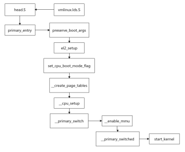
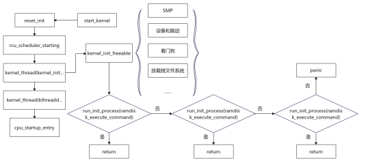

# 1. 内核启动流程分析
## 1.1. 编译配置：
* make menuconfig
* 使用默认配置，在上面修改
* 使用厂家提供的配置

所有config都会生成.config文件。

配置项为例，配置网卡设备。可以在源码中分析，看在哪个源码进行配置。源码文件和makefile文件等涉及。
子目录的makefile：

## 1.2. 分析Makefile：第一个文件、链接脚本

makefile分类：
如何编译生成.o,然后 xx.o再链接到内核。

makefile生成两个主要文件：
* head.s：第一个文件
* arch/arm/kernel/vmlinux.lds:链接脚本决定了文件顺序，代码段、数据段等如何排布，arch目录架构相关的源代码。

## 1.3. 内核启动
内核启动要做什么事情？首先处理uboot传入的参数。
1. 判断是否支持这个CPU
2. 判断是否支持这个单板
3. 建立页表，启动 MMU
4. 使能MMU
5. 跳转到start_kernel(内核的第一个c函数)

最终目的：根文件系统挂载，运行应用程序。

linux-5.16/arch/arm64/kernel/vmlinux.lds文件：
包括：架构初始化的信息等。

例如：
```c
MACHINE_START(MINI2440, "MINI2440")
	/* Maintainer: Michel Pollet <buserror@gmail.com> */
	.atag_offset	= 0x100,
	.map_io		= mini2440_map_io,
	.init_machine	= mini2440_init,
	.init_irq	= s3c2440_init_irq,
	.init_time	= mini2440_init_time,
MACHINE_END

```
内核支持多少个单板，就有多少个.c文件，编译进去，就支持这个单板。


### 1.3.1. 接下来分析start_kernel做了哪些事情？

init/main.c：
输出版本信息，
setup_arch:处理boot传入启动参数，setup_mechine,内核的参数解析，设置。
arch/arm64/kernel/setup.c源码中，命令行参数 就是boot_args参数，

```shell
	setup_arch(&command_line);
	setup_boot_config();
	setup_command_line(command_line);
```
start_kernel做完一些列初始化后，会调用arch_call_rest_init();然后直接调用rest_init接口。

```c
start_kernel
    setup_arch()// 解析uboot传入的启动参数
    arch_call_rest_init()
        rest_init()
            pid = kernel_thread(kernel_init, NULL, CLONE_FS);
                kernel_init();
                    kernel_init_freeable(void);
                        prepare_namespace();
                            mount_root(); //挂载根文件系统
                        init_mount(".", "/", NULL, MS_MOVE, NULL);
                            // 执行应用程序
```
#### 1.3.1.1. uboot传入的参数有哪些东西？

```c
init/do_mounts.c：将机器ID等信息从这里 获取，写入对应 的位置。
static int __init root_dev_setup(char *line)
{
	strlcpy(saved_root_name, line, sizeof(saved_root_name));
	return 1;
}

__setup("root=", root_dev_setup); // 就是宏展开

```
## 1.4. 构建文件系统之启动第一个程序
应用程序？内核启动之后启动哪个应用程序呢？

## 1.5. 构建根文件系统之init进程分析

busybox：小功能的组合。
[busybox启动流程简单解析](https://www.cnblogs.com/arnoldlu/p/10868354.html)
init_main()是busybox的init进程的入口。init作为承接作用，上承kernel，下起用户空间进，配置了整个用户空间工作环境。
首先初始化串口、环境变量等；解析/etc/inittab文件；初始化信号处理函数；然后依次执行SYSINIT、WAIT、ONCE选项；最后在while(1)中监控RESPAWN|ASKFIRST选项。

# 2. linux启动流程

## 2.1. 内核启动入口
arch/arm64/kernel/vmlinux.lds.S文件为kernel链接文件，它描述了程序入口为_text。arch/arm64/kernel/head.S中__HEAD为程序起始代码。

## 2.2. 入口到start_kernel

uboot将控制权移交给kernel的时候，MMU、D-cache是关闭的。
### primary_entry（MMU开启之前）
preserve_boot_args：保存x0~x3到boot_args[0~3]；
el2_setup：异常级别的切换以及不同级别的部分控制寄存器设置；
set_cpu_boot_mode_flag：boot 级别的标记保存，后续会使用相关变量来判断启动级别来做一些不同的初始化；
__create_page_tables：配置和初始化启动阶段的页表，包括 idmap_pg_dir 和 init_pg_dir；
__cpu_setup：对整个系统的工作的相关寄存器进行初始化及配置，包括控制寄存器，TCR 寄存器等；
__primary_switch：剩余的所有初始化，包括开启 mmu，设置 sp，异常向量表，地址重定向，地址随机化等；
### __primary_switch（开启MMU）
__enable_mmu:开启MMU；
### __primary_switched（开启MMU后）
开启MMU之后，CPU访问的是虚拟地址，再进行栈设置和异常向量表设置。
start_kernel：启动内核。
此外将通过secondary_entry启动从核，流程为el2_setup、set_cpu_boot_mode_flag与secondary_startup。


start_kernel函数中会调用大量的函数，进行任务栈结束魔术数、SMP处理器ID、cgroup、CPU、页地址、架构相关等初始化设置，最后会调用arch_call_rest_init，即reset_init函数。reset_init中关键流程为：
* rcu_scheduler_starting：启动 RCU 锁调度器；
* kernel_thread(kernel_init...： 创建 kernel_init 线程，init 进程的 PID 为 1；
* kernel_thread(kthreadd...：创建kthreadd 内核进程，此内核进程的 PID 为 2。kthreadd进程负责所有内核进程的调度和管理；
* cpu_startup_entry：进入 idle 进程即空闲进程， PID 为 0。
* 在kernel_init函数中，会调用如下关键函数：
* kernel_init_freeable：完成 init 进程的一些其他初始化工作，如启动smp、初始化设备和驱动程序、看门狗、初始化文件系统（挂载根文件系统）等等；
* run_init_process(ramdisk_execute_command)：通常在使用了initramfs（初始内存文件系统）的情况下使用。通过uboot或在bootargs使用“rdinit=xxx”设置init程序，系统会尝试查找该程序；
* run_init_process(execute_command)：通常在没有使用initramfs的情况下使用。通过uboot或在bootargs使用“init=xx”设置init程序，系统会尝试查找该程序；
* try_to_run_init_process：一次查找“/sbin/init”、“/etc/init”、“/bin/init”、“/bin/sh”；
* panic("No working init found)：以上步骤都没有找到用户空间的init程序，那么系统panic并打印错误。
