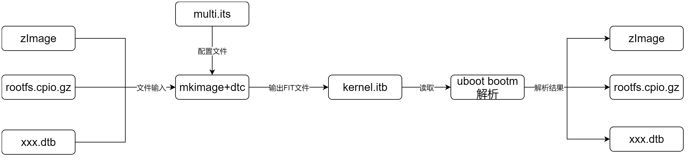

### 背景知识
在编译kernel之后，会生成Image或者压缩过的zImage。但是这两种镜像格式并没有办法给uboot的足够信心来进行load、jump或者验证操作哟等。因此，uboot提供了mkimage工具，来将kernel制作为uboot可以识别的格式，将生成的文件称之为uImage。

uboot支持两种类型的uImage：
* Legacy-uImage
在kernel镜像的基础上，加上64Byte的信息提供给uboot使用。
* FIT-uImage
以类似FDT的方式，将kernel、fdt、ramdisk等等镜像打包到一个image file中，并且加上一些需要的信息（属性）。uboot只要获得了这个image file，就可以得到kernel、fdt、ramdisk等等镜像的具体信息和内容。

#### 对比优缺点：
Legacy-uImage实现较为简单，并且长度较小。但是实际上使用较为麻烦，需要在启动kernel的命令中额外添加fdt、ramdisk的加载信息。
而FIT-uImage实现较为复杂，但是使用起来较为简单，兼容性较好,（可以兼容多种配置）。但是需要的额外信息也较长。

## 主要分析FIT-uImage
### 原理说明
flattened image tree，类似于FDT(flattened device tree)的一种实现机制。其通过一定语法和格式将一些需要使用到的镜像（例如kernel、dtb以及文件系统）组合到一起生成一个image文件。其主要使用四个组件。

- its文件：
    image source file，类似于dts文件，负责描述要声称的image的的信息。需要自行进行构造。
- itb文件：
    最终得到的image文件，类似于dtb文件，也就是uboot可以直接对其进行识别和解析的FIT-uImage。
- mkimage：
    mkimage则负责dtc的角色，用于通过解析its文件、获取对应的镜像，最终生成一个uboot可以直接进行识别和解析的itb文件。
- image data file ：
    实际使用到的镜像文件。

mkimage将its文件以及对应的image data file，打包成一个itb文件，也就是uboot可以识别的image file（FIT-uImage）。我们将这个文件下载到么memory中，使用bootm命令就可以执行了。

FIT-uImage的格式类似于DTB。uboot会去解析出FIT-uImage中的configurations节点，根据节点选择出需要的kernel、dtb、rootfs。因此，在节点的基础上，添加很多节点信息，提供uboot使用。

### FIT方案包括如下部分：
1. 编写its文件
2. 通过mkimage+dtc生成FIT镜像itb文件
3. uboot启动时通过bootm解析FIT镜像
4. 跳转到Linux执行镜像；如果是存在ramdisk，则作为initrd在Linux启动过程中解析创建ramfs。

FIT还有一个功能是对镜像内容进行校验，后续会继续分析基于FIT的校验和验签流程

### FIT镜像创建流程



### its文件分析

## uboot启动流程分析

### FIT镜像解析流程
#### bootm命令使用
```cpp
bootm--后面没有地址则使用CONFIG_SYS_LOAD_ADDR地址作为启动地址。
bootm <addr>--使用default配置启动。
bootm <addr>:<image name>--单独加载FIT中<image name>镜像。
bootm <addr>#<config name>--使用指定<config name>启动。

```


#### bootm流程解析

```cpp
do_bootm
　　->do_bootm_states--根据states调用一系列函数进行处理。
　　　　->bootm_start
　　　　->bootm_find_os--加载OS镜像。
　　　　　　->boot_get_kernel
　　　　　　　　->fit_image_load--从指定或默认configuration中加载kernel镜像。
　　　　　　->genimg_get_format--对于IMAGE_FORMAT_FIT类型镜像，从FIT中获取kernel镜像。
　　　　　　　　->fit_image_get_type--images.os.type。
　　　　　　　　->fit_image_get_comp--images.os.comp。
　　　　　　　　->fit_image_get_os--images.os.os。
　　　　　　　　->fit_image_get_arch--images.os.arch。
　　　　　　　　->fit_image_get_load--images.os.load。
　　　　　　　　->fit_image_get_entry--images.ep。
　　　　->bootm_find_other--加载OS相关镜像，比如ramdisk和dtb等。
　　　　　　->bootm_find_images
　　　　　　　　->boot_get_ramdisk--获取images.rd_start和images.rd_end。
　　　　　　　　　　->fit_image_load--从FIT镜像中获取ramdisk文件。
　　　　　　　　->boot_get_fdt--获取images.ft_addr和images.ft_len。
　　　　　　　　　　->boot_get_fdt_fit--从FIT中获取dtb文件。
　　　　　　　　　　　　->fit_image_load--根据fdt镜像名获取dtb文件。
　　　　->bootm_load_os
　　　　　　->image_decomp--解压缩kernel镜像。至此kernel镜像已经完成加载。
　　　　->boot_ramdisk_high--根据initrd_high的值否则分配地址移动initrd内容。自此ramdisk内容就绪。
　　　　->boot_relocate_fdt--根据fdt_high的值否则分区地址移动fdt内容。至此fdt内容就绪。
　　　　->bootm_os_get_boot_func--根据os类型从boot_os[]获取启动函数，linux对应do_bootm_linux()。
　　　　->boot_selected_os
　　　　　　->do_bootm_linux
　　　　　　　　->boot_prep_linux
　　　　　　　　　　->image_setup_linux
　　　　　　　　　　　　->boot_fdt_add_mem_rsv_regions
　　　　　　　　　　　　->boot_relocate_fdt
　　　　　　　　　　　　->image_setup_libfdt--根据需要更新dtb文件内容。
　　　　　　　　　　　　　　->fdt_root
　　　　　　　　　　　　　　->fdt_chosen
　　　　　　　　　　　　　　->arch_fixup_fdt
　　　　　　　　　　　　　　->fdt_initrd--创建或更新linux,initrd-start和linux,initrd-end节点。
　　　　　　　　->boot_jump_linux
　　　　　　　　　　->kernel_entry(0, machid, r2)--kernel_entry即为kernel镜像的entry属性，machid是从环境变量machid获取，r2为dtb地址。
```

## 参考文献
[FIT-itb image](https://blog.csdn.net/JerryGou/article/details/85170949)
[FIT镜像创建启动解析](https://www.cnblogs.com/arnoldlu/p/17912109.html)