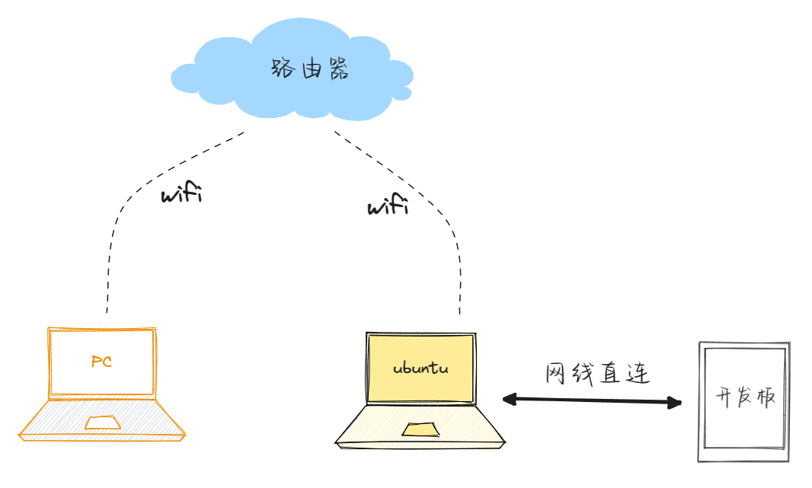

im6ull--韦东山的单板

开发环境概述：
windows10:个人PC
ubuntu20.04:应用以前的电脑当作一个服务器用
im6ull开发板：

主要思路：
通过个人PC远程连接ubuntu物理机，然后通过开发板与ubuntu物理机直连，进行开发板开发环境搭建。
目前是通过ubuntu实现minicom串口连接开发板，操作开发板配置调试开发板。


其中，需要注意的是minicom需要配置才可以远程操作linux开发板。且为了ubuntu与linux开发板之间可以网络连接，需要在ubuntu中进行网络IPv4的手动设置，设置流程：

然后ubuntu可以配置任意192.168.xxx.xxx网段，根据ubuntu物理机配置的IP，然后配置开发板的IP，目前使用的是linux开发板的eth0。
此时ubuntu和linux开发板可以实现ssh和sftp文件传输，则可以通过scp传输文件到开发板。

然后参考手册进行内核编译学习，目前烧写镜像，可以通过scp linux内核到boot目录。

```shell
make mrproper
remainder@remainder:~/100ask_imx6ull-sdk/Linux-4.9.88$ make 100ask_imx6ull_defconfig
remainder@remainder:~/100ask_imx6ull-sdk/Linux-4.9.88$ make zImage -j4
remainder@remainder:~/100ask_imx6ull-sdk/Linux-4.9.88$ make dtbs
#生成文件
remainder@remainder:~/100ask_imx6ull-sdk/Linux-4.9.88$ ls arch/arm/boot/zImage 
remainder@remainder:~/100ask_imx6ull-sdk/Linux-4.9.88$ ls arch/arm/boot/dts/100ask_imx6ull-14x14.dtb 
```

对应的scp文件到单板的dtb中去。

