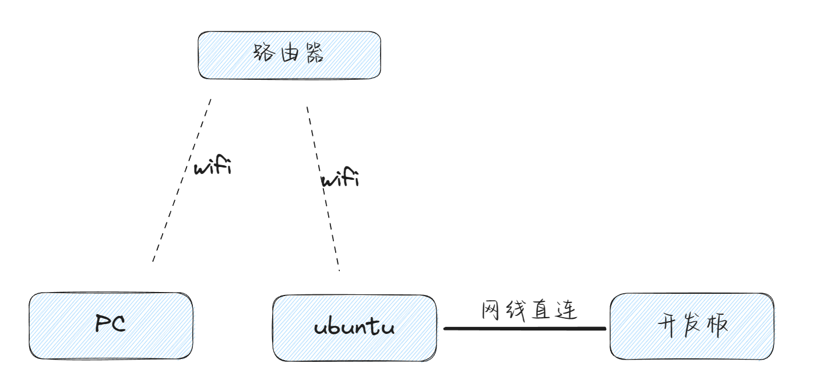
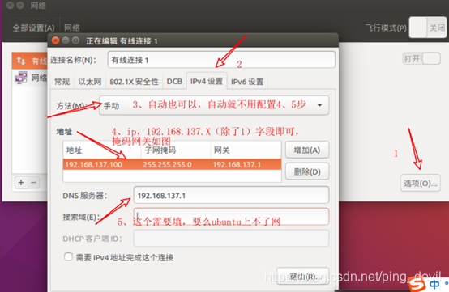

参考：《百问网QEMU使用手册》

# 内核编译

1. 配置编译内核、设备树、驱动
2. 放到板子上
3. 编译、测试第一个驱动

# 编译安装内核

## git仓库文件目录
### qemu使用主要两个目录
#### 获取QEMU镜像
在Ubuntu中执行以下命令：
```shell
git  clone  https://e.coding.net/weidongshan/ubuntu-18.04_imx6ul_qemu_system.git
```

#### kernel源码目录以及工具链
考虑到代码仓库过多，特使用repo工具管理代码。
先用git clone下载repo工具，再用repo工具下载源码：
```shell
book@100ask:~$  git clone https://e.coding.net/codebug8/repo.git
book@100ask:~$  mkdir -p 100ask_imx6ull-qemu  && cd 100ask_imx6ull-qemu
book@100ask:~/100ask_imx6ull-qemu$ ../repo/repo init -u https://e.coding.net/weidongshan/manifests.git -b linux-sdk -m  imx6ull/100ask-imx6ull_qemu_release_v1.0.xml --no-repo-verify
book@100ask:~/100ask_imx6ull-qemu$ ../repo/repo sync -j4
```
上面使用的repo管理的是国内coding仓库，从国内仓库下载会快很多。如果一切正常，你在/home/book目录下创建了一个100ask_imx6ull-qemu目录，里有如下容：

如上两个目录下载完成。

### 设置工具链
交叉编译工具链主要是用于在ubuntu主机上编译可以在其它平台上运行的系统，比如在PC上为ARM板子编译程序。
设置交叉编译工具主要是设置PATH， ARCH和CROSS_COMPILE三个环境变量，下面介绍具体设置方法。

如需永久修改，请修改用户配置文件。在Ubuntu系统下，修改如下：
```shell
book@100ask:~$ vi  ~/.bashrc
```
在行尾添加或修改：
```shell
export ARCH=arm
export CROSS_COMPILE=arm-linux-gnueabihf-
export PATH=$PATH:/home/yujuncheng/learn_remainder/weidongshan/100ask_imx6ull-qemu/ToolChain/gcc-linaro-6.2.1-2016.11-x86_64_arm-linux-gnueabihf/bin/
```

完成以上交叉工具链设置完成进行内核编译。

## 编译内核
### 前期概述
不同的开发板对应不同的配置文件，配置文件位于内核源码arch/arm/configs/目录。注意配置文件名称，在编译内核用到，且qemu和板子以及不同会配置文件不同，导致编译无法通过。
/home/book/book_share/imx-linux4.9.88/arch/arm/configs
```shell
remainder@remainder:~/weidongshan/100ask_imx6ull-qemu/linux-4.9.88/arch/arm/configs$ ls
100ask_imx6ull_qemu_defconfig  
```
### 编译内核以及设备树
1. 进入源码目录
2. make mrproper
3. 编译配置文件：make 100ask_imx6ull_qemu_defconfig。文件目录内核源码arch/arm/configs/目录。
4. make zImage -jN //编译zImage 内核镜像，其中N参数可以根据CPU个数，来加速编译系统。 
5. make dtbs   //编译设备树文件

```shell
book@100ask:~/100ask_imx6ull-qemu$ cd linux-4.9.88
book@100ask:~/100ask_imx6ull-qemu/linux-4.9.88$ make mrproper
book@100ask:~/100ask_imx6ull-qemu/linux-4.9.88$ make 100ask_imx6ull_qemu_defconfig
book@100ask:~/100ask_imx6ull-qemu/linux-4.9.88$ make zImage -jN //编译zImage 内核镜像，其中N参数可以根据CPU个数，来加速编译系统。 
book@100ask:~/100ask_imx6ull-qemu/linux-4.9.88$ make dtbs   //编译设备树文件
```
编译成功后，可以得到如下文件：
```shell
arch/arm/boot/zImage                       // 内核
arch/arm/boot/dts/100ask_imx6ul_qemu.dtb    // 设备树
```
如果你修改过内核，或是修改过设备树文件，那么可以用上面2个文件去替换QEMU中的zImage和100ask_imx6ul_qemu.dtb。
QEMU中的zImage和100ask_imx6ul_qemu.dtb在哪？你安装我们提供的QEMU时，可以得到这样的脚本：qemu-imx6ul-gui.sh。打开它就可以知道这2个文件在哪里了。
一般位于imx6ul-system-image目录下：

### 编译中遇到的问题
```bash
https://blog.csdn.net/zhoukaiqili/article/details/126191871

diff --git a/scripts/dtc/dtc-lexer.lex.c_shipped b/scripts/dtc/dtc-lexer.lex.c_shipped
index ba525c2f..a2fe8dbc 100644
--- a/scripts/dtc/dtc-lexer.lex.c_shipped
+++ b/scripts/dtc/dtc-lexer.lex.c_shipped
@@ -637,7 +637,7 @@ char *yytext;
 #include "srcpos.h"
 #include "dtc-parser.tab.h"
 
-YYLTYPE yylloc;
+extern YYLTYPE yylloc;
 extern bool treesource_error;
 
 /* CAUTION: this will stop working if we ever use yyless() or yyunput() */
```

## 修改文件系统


# 配置开发环境



minicom使用：默认设置才可以输入。


需要设置网卡，任意网卡信息如下：




目前满足开发环境：

ssh连接，scp传输文件，minicom串口连接，linux自己烧写linux内核。
参考官方手册。目前单板开发环境配置完成，且系统烧写也处理完成。