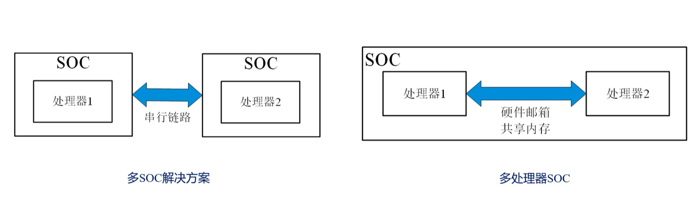
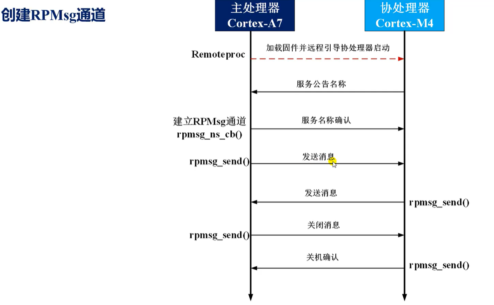
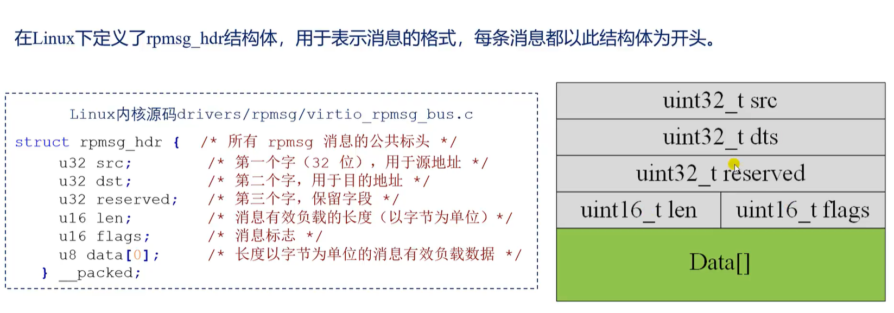
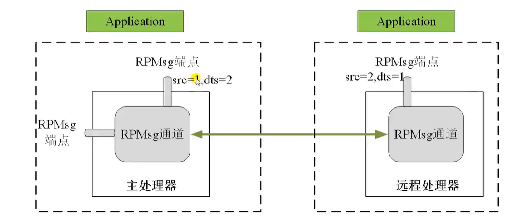
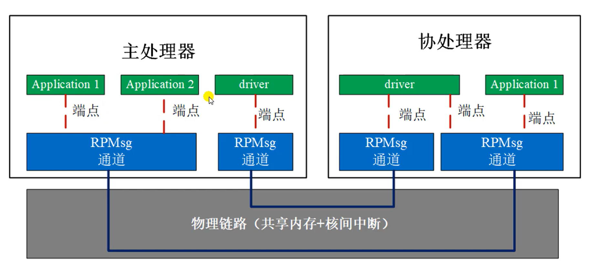
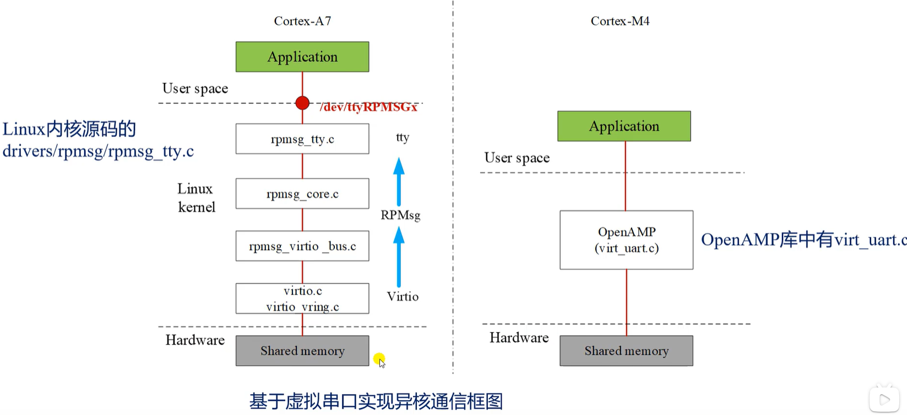

SMP和AMP



共享内存

IPC

### 注册virtio和配置缓冲区


通过设备id进行注册，
所有消息都是在rpmsg中传递。


#### 缓冲区和消息格式
在linux下定义了rpmsg_hdr结构体，用于表示消息的格式，每条消息都以此结构体为开头。


### RPmsg端点
基于RPmsg通道，用户可以在主处理器或者远程处理器创建一个或者多个RPmsg端点（endpoint）
每个RPmsg端点都有一个唯一的本地地址和关联的接收回调函数。
每个通道都有一个默认的端点，即使用户没有创建端点，也可以使用默认端点。



共享的内存和核间中断，我们可以称为物理链路，或者称为通信链路，一条物理链路可以提供多个通信通道。



异构核间通信--openAMP框架

include/linux/remoteproc.h文件中的rproc结构体：

```cpp
struct rproc {
	struct list_head node; // rproc对象的节点
	struct iommu_domain *domain;
	const char *name;  // rproc可读名称，即远程处理器的名称
	const char *firmware;  // 要加载的固件文件名字
	void *priv;
	const struct rproc_ops *ops;
	struct device dev;
	const struct rproc_fw_ops *fw_ops;
	atomic_t power;
	unsigned int state;
	struct mutex lock;
	struct dentry *dbg_dir;
	struct list_head traces;
	int num_traces;
	struct list_head carveouts;
	struct list_head mappings;
	struct completion firmware_loading_complete;
	u32 bootaddr;
	struct list_head rvdevs;
	struct idr notifyids;
	int index;
	struct work_struct crash_handler;
	unsigned int crash_cnt;
	struct completion crash_comp;
	bool recovery_disabled;
	int max_notifyid;
	struct resource_table *table_ptr;
	struct resource_table *cached_table;
	bool has_iommu;
	bool auto_boot;
};
```

## 基于虚拟串口实现异构核间通信



抽象出虚拟串口节点